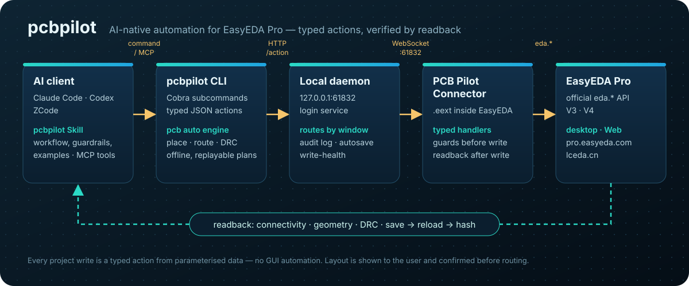

<p align="center">
  
</p>

<h1 align="center">pcbpilot</h1>

<p align="center">
  AI-native automation layer for EasyEDA.
</p>

<p align="center">
  <a href="https://github.com/zhuangzard/pcbpilot"><b>GitHub</b></a> ·
  <a href="README.md">中文</a>
</p>



> **Version 1.4.5.** Schematic work starts from component,
> pin, and connectivity data: design each Lib circuit and its geometry locally,
> compose one sheet with `sch compose`, then execute and verify with `sch apply`.
> See [1.4 release and validation](docs/releases/release-1.4.md) for release status and validation limits.

`pcbpilot` turns the official EasyEDA extension API into a typed, observable, Skill-friendly system. The EasyEDA plugin stays thin: it connects to the local agent and executes approved actions. The Go CLI/daemon owns protocol, state, artifacts, validation, and user-facing workflows.

## Why This Exists

The upstream `run-api-gateway` proves the important entry point: code can run inside EasyEDA with access to the official `eda` object. Its rough edge is that it exposes raw JavaScript execution as the main workflow. That is powerful, but brittle for agents.

The connector is real and working: the daemon defaults to a **single fixed port `61832`** (it never spills to the next; a stale pcbpilot daemon already holding it is taken over automatically), the connector locks onto it, validates a handshake, reconnects, and dispatches typed actions to the official `eda.*` API. `debug.exec_js` remains available for temporary debugging within the task's scope. See [docs/FEATURES.md](docs/FEATURES.md) for the feature/roadmap inventory.

This project moves the system into a better shape:

- Skill describes expert workflow and guardrails.
- Go CLI/daemon exposes stable typed actions.
- EasyEDA connector plugin only bridges to official `eda.*` APIs.
- Artifacts, screenshots, DRC results, and audit logs are first-class outputs.

## How It Works

`pcbpilot` keeps the automation surface narrow and observable:

- A Skill or human runs an `pcbpilot` command.
- The Go CLI validates inputs and submits a typed action to the local daemon.
- The daemon tracks connected EasyEDA windows, routes each action over WebSocket, and records audit logs, artifacts, and validation results.
- The connector extension runs inside EasyEDA and calls the official `eda.*` API.
- Structured results flow back to the CLI and Skill, so the next step can be planned from real editor state.

The action catalog now spans schematic, PCB, document navigation, board binding, artifacts, and diagnostics. The current inventory and roadmap live in [docs/FEATURES.md](docs/FEATURES.md).

## Standing on the Shoulders of Giants

We don't reinvent the wheel — we stack proven layers so an AI agent can use them directly:

- **Official `eda.*` API** — the 86 namespaces EasyEDA Pro exposes are the real capability substrate;
- **Upstream `run-api-gateway`** — proved the key entry point (code runs inside EasyEDA, reaching the `eda` object);
- **A mature AI-Agent Skill pattern** — a Skill describes the expert workflow + guardrails, and typed actions make every step **observable, verifiable, and replayable** instead of handing raw JS to the model.

On top of those three, pcbpilot adds the engineering middle layer: a self-healing connector, a typed action catalog, real-bbox validation, a gated design flow, and the **flagship capability** below — the circuit-block library.

## Core Capabilities & Highlights

| Domain | What it does |
|---|---|
| Private device libraries | Create Symbol, Footprint and Device assets from documented pin and package geometry. [AS07 case study (Chinese)](docs/examples/as07-m1101d-sma/README.md) includes the drawing, final specifications, official renders and readbacks; follow-up edits used the API debug path. Instance wiring, PCB DRC and physical fit remain unverified. |
| **Circuit-block library (flagship)** | Community-built, credited library of **proven peripheral subcircuits** (CH340 USB-serial, ESP32 auto-download, button de-bounce, USB-hub, buck…). **Copy the topology, only rebind boundary nets** to reuse |
| Schematic | Canonical connectivity → Lib geometry → compact Z-order `sch compose` on one sheet → `sch apply`; normal designators stay separate from functional Role; each pink dashed frame fits its contents with a minimum inset and a 0.2 inch title |
| Validation | Local data checks, Apply readback of pins/nets/NC/geometry, and the four-stage `sch gate --strict`: layout-lint → check → bridge-check → drc |
| PCB | Auto-layout, board outline, keep-outs, rule-aware short-route, 4-layer power planes, copper pour, silkscreen avoidance, DRC/`pcb check` |
| Design flow | Gated spine from a **customer-voice requirement** to a finished board (S0–S6 + P0–P10), milestone confirmation, save checkpoints |
| Artifacts | BOM (LCSC C-number enrichment), netlist, export, native screenshots, audit log, record→replay |

### Highlight: the circuit-block library (contribute once, benefit forever)

**Fixed peripheral circuits can be copied verbatim.** The ESP32 auto-download circuit,
CH340 USB flashing, button de-bounce, USB-hub… their **internal topology is fixed** —
re-drawing them each time means re-walking the same pitfalls. The library distills them
into **validated, reusable blocks**: you only rebind the few boundary nets (ports) to the
host MCU, pins are referenced by **functional name** (so **zero pin-renumbering**), and
parts point back into the standard-parts library (BOM-ready).

- **Community-built + credited** — every block carries `author`/`contributors`; **contribute once, benefit forever**;
- **Validation gate** — a block only enters after passing `place → wire → check → DRC=0`, not "looks-right" prose;
- **Three dimensions** — parts (with alternatives) + schematic-wiring notes + PCB layout electrical constraints, all in one block;
- **AI-consumable** — the agent checks the library before hand-wiring a peripheral; on a hit it copies, skipping a whole module's selection + wiring.

> The library is embedded in the CLI: `pcbpilot blocks ls/show/search` works offline,
> without a daemon or editor window. Contribution guide:
> [`standard-blocks-contributing.md`](.agents/skills/pcbpilot/references/standard-blocks-contributing.md)

## Install

> **Full setup & usage notes: [Quick Start →](docs/quick-start.md)** — the
> three required parts (CLI / connector `.eext` / Skill), version alignment,
> starting the daemon, upgrade discipline, and a troubleshooting table. **On
> upgrade, bump all three (CLI + connector + Skill) to the same version**, or
> `pcbpilot daemon health` flags the lagging connector as stale.

Install the `pcbpilot` CLI/daemon first, then import the **strictly CLI-version-locked**
GitHub-Release `.eext` whose URL the installer prints. pcbpilot's connector
("PCB Pilot Connector") is not on the 立创EDA marketplace — the marketplace entry
"EDA Agent Connector" belongs to the upstream easyeda-agent project. The two can be
installed side by side (different uuid, ports 61832–61841 vs 60832–60841).

> **Attribution**: pcbpilot is a fork of
> [zhoushoujianwork/easyeda-agent](https://github.com/zhoushoujianwork/easyeda-agent) (MIT).
> The CLI, daemon, connector, typed actions, skills and most docs come from that project,
> whose full history is preserved here. Thank you to the original author and contributors.

macOS / Linux:

```bash
curl -fsSL https://raw.githubusercontent.com/zhuangzard/pcbpilot/main/install.sh | bash
```

Native Windows (Windows PowerShell 5.1 or PowerShell 7):

```powershell
irm https://raw.githubusercontent.com/zhuangzard/pcbpilot/main/install.ps1 | iex
```

The one-line script installs/updates the `pcbpilot` CLI/daemon, auto-detects
installed clients and installs/updates the `pcbpilot` skill into each —
Codex (`~/.codex/skills/pcbpilot`) and Claude Code
(`~/.claude/skills/pcbpilot`) — and prints the connector `.eext` import URL.
Both scripts fetch `checksums.txt` first and verify every asset's SHA-256, the
CLI `--version` and the skill's `metadata.version` before replacing an installed
file. Control skill install with env vars:

```bash
curl -fsSL .../install.sh | PCBPILOT_INSTALL_SKILLS=codex,claude bash  # force targets
curl -fsSL .../install.sh | PCBPILOT_INSTALL_SKILLS=none bash  # skip skills
curl -fsSL .../install.sh | PCBPILOT_SKILL_PRESERVE=1 bash  # keep local edits
curl -fsSL .../install.sh | PCBPILOT_VERSION='<vX.Y.Z>' bash  # pin a release (skips the API)
```

```powershell
$env:PCBPILOT_INSTALL_SKILLS = 'codex,claude'   # same knobs on Windows
$env:PCBPILOT_VERSION = '<vX.Y.Z>'              # pin a release (skips the API)
irm .../install.ps1 | iex
```

`install.ps1` installs to `%USERPROFILE%\.local\bin` and never edits PATH
silently: if that directory is not on the user PATH it prints the exact command
to add it, and only changes the user PATH when you pass `-AddToPath` (running it
as a file) or set `$env:PCBPILOT_ADD_TO_PATH=1`. The machine PATH is never
touched. If `pcbpilot.exe` is locked by a running daemon, the old file is renamed
aside so the upgrade still completes — restart the daemon afterwards.

**Hitting `403` / GitHub API rate limit?** The script calls `api.github.com` once to
resolve the latest release, and unauthenticated calls are capped at 60 requests/hour
per IP — a shared office / NAT / CI address runs out fast. Two ways out (the error
message prints them too):

```bash
export GITHUB_TOKEN=<token>   # GH_TOKEN works too
gh auth login                 # an authenticated gh CLI is picked up automatically (5000/hour)

curl -fsSL .../install.sh | PCBPILOT_VERSION='<vX.Y.Z>' bash   # or pin a tag and skip the API
```

Available tags: [Releases](https://github.com/zhuangzard/pcbpilot/releases).

The published skill slug is `pcbpilot` (suffix intentional: it distinguishes this
community automation layer from official EasyEDA tooling). To install only the skill
from a registry:

```bash
# ClawHub (published automatically by `make release`, version matches the repo)
clawhub install pcbpilot
```

> SkillHub has its own [official CLI](https://skillhub.cn), which is incompatible
> with other tools also named `skillhub`. Use the installer above or the GitHub
> Release `skills.tar.gz` when you need the same version as the CLI and connector.

The old split skills (`easyeda-schematic`, `easyeda-pcb`, `easyeda-design-flow`,
`easyeda-conventions`) have been merged and removed from the repository.

### Recommended prompt for an AI agent

Give the following prompt to the agent together with the actual design request:

```text
Use pcbpilot to complete this EasyEDA Pro task.

Use EasyEDA Pro V4. Version 4.1.60 or a newer V4 build is recommended; if
pcbpilot health reports hostCompatibility=block for V3, stop live writes and
upgrade the editor first.

Before editing, confirm that these three parts use the same release version:
1. pcbpilot CLI/daemon
2. pcbpilot Skill
3. EDA Agent Connector extension

Run pcbpilot update --check --exit-code. If the CLI or Skill is behind, run pcbpilot
update. If the connector is behind, install pcbpilot-connector.eext from the
same GitHub Release, save open documents, then fully quit and restart EasyEDA.
Enable Allow external interaction and run pcbpilot health to verify the target
project, page, and versions.

For schematic work, first read or create a local canonical connectivity JSON. Treat
components, complete physical pins, stable net IDs, and pin-to-net/NC records as the
source of truth. Compute component XY positions, orientations, wires, and functional
Libs locally, then generate the diff/Apply queue. After Apply, read every pin back,
run layout-lint, check, bridge-check, and DRC, save explicitly, and inspect an export.
Do not guess connectivity from screenshots, change existing designators, confuse GPIO
numbers with physical pin numbers, or report unverified/WARN results as passing.
```

### Optional: MCP integration

The repository's [`mcp/`](mcp) directory provides a local stdio MCP adapter for
agents such as Codex. It reuses the existing `pcbpilot` CLI/daemon and does not
bypass typed actions, auditing, workflow gates, or the official `eda.*` API. The
arbitrary-JavaScript `debug.exec_js` domain is intentionally not exposed through
MCP.

```bash
npm --prefix mcp ci --ignore-scripts
codex mcp add pcbpilot \
  --env PCBPILOT_BIN="$(command -v pcbpilot)" \
  -- node "$(pwd)/mcp/src/server.mjs"
```

Restart the agent client after registration. Other MCP clients can use the same
stdio command and environment configuration. See [`mcp/README.md`](mcp/README.md)
for the tool inventory and development checks.

## Showcase

### Access control example: local data → SCH Apply → a real schematic

Components, physical pins, stable net IDs, and NC states live in a local
connectivity graph. The agent calculates component positions, orientations,
and wiring within each functional Lib from measured pin geometry, composes the
page, then applies the plan to EasyEDA and checks the readback. Original
designators and component identities stay intact.

**23 components · 165 physical pins · 28 nets · 2 schematic sheets**

#### Power and RF controller


Power, the RF controller, and the programming interface each form a Lib.
Peripheral wiring follows pin directions, terminal wires use staggered lengths,
and pink dashed frames with 0.2 inch titles are calculated from the data.

#### Talk controller and peripheral interfaces


Libs follow a Z-order reading sequence from the top left. Each frame fits its own
contents with a minimum inset; frames align at the top of each row, and the next
row starts below its tallest frame. Titles use available space above or below
the circuit to reduce height.

#### SCH Apply in action


The animation uses 12 official exports captured during the power and RF controller
sheet's actual Apply, played back at an accelerated pace. Both still images come from official EasyEDA exports, with the displayed project name anonymized.
See [Apply capture instructions](docs/schematic-showcase.md) for the script and reproduction steps.
Both sheets passed local layout and connectivity checks with zero errors and
warnings. Official DRC still reports 3 warnings, so the strict gate did not pass;
some text placement needs refinement. See [the 1.4 validation record](docs/releases/release-1.4.md) for the tested scope.

### Historical PCB case: ESP32-S3-WROOM-1 minimal system board

This separate regression case starts from the raw requirement in
[esp32MiniRequire.md](esp32MiniRequire.md), with the agent selecting real LCSC
parts and designing the circuit. See the [full PCB case study](docs/showcase-esp32-mini.md).


The board below was produced by the agent driving the full PCB flow — **auto-place →
outline-fit → rule-aware route → 4-layer power planes → collision-aware silk** — then
verified on the real EasyEDA canvas (DRC 31 → 3 violations, No-Connection → 0):

<p align="center">
  
</p>

A few individual steps, each a real before/after on the same board:

| `pcb outline-fit` — tighten board to parts (17% → 71% utilization) | `pcb silk-align` — collision-aware designators |
|---|---|
|  →  |  → produces the aligned designators in the board above |

> The images above are real `pcb snapshot` captures from the fixed regression board.

## Repository Layout

```text
cmd/pcbpilot/                 CLI entrypoint used by humans and Skills
internal/app/                CLI command implementation
internal/daemon/             Local daemon: /health, /eda (connector WS), /action
internal/protocol/           Typed action protocol shared with connector (actions.go)
internal/version/            Build/version metadata
extension/                   EasyEDA connector (.eext) source + build (TypeScript → esbuild)
.agents/skills/pcbpilot/        Merged public Skill: workflow, references, scripts, canonical data
docs/                        Architecture, protocol, features/roadmap, conventions, decisions
```

## Current Commands

```bash
go run ./cmd/pcbpilot version
go run ./cmd/pcbpilot actions
go run ./cmd/pcbpilot daemon start
go run ./cmd/pcbpilot daemon health
go run ./cmd/pcbpilot doc ls --project <name>
go run ./cmd/pcbpilot sch drc --project <name>
go run ./cmd/pcbpilot pcb drc --project <name>
go run ./cmd/pcbpilot board list --project <name>
go run ./cmd/pcbpilot call system.health
```

`daemon start` starts the local server. It defaults to a **single fixed port `127.0.0.1:61832`** — never spilling to the next, so the connector always finds it there. A stale pcbpilot daemon already holding that port is taken over automatically; a foreign process makes it ask (interactive) or refuse (headless). It serves three endpoints, then runs until interrupted (Ctrl-C / SIGTERM):

- `GET /health` — service identity, version, and connected windows
- `GET /eda` — WebSocket the EasyEDA connector registers on (daemon sends a `handshake` on connect)
- `POST /action` — a typed action envelope to forward to a connected window

`daemon health` probes for the local `pcbpilot` daemon; the daemon and connector use port `61832` by default. With the daemon running it reports `status: found` and lists connected windows; otherwise a clean `not_found` result is expected.

`call <action>` finds the running daemon and posts a typed action to it. `system.health` is answered by the daemon itself (no connector required); window-scoped actions need a connected EasyEDA window and return `NO_CONNECTOR` until the connector extension is running.

Both sides of the action protocol are in place and working. The Go daemon owns the protocol, state, artifacts, and validation; the EasyEDA connector under `extension/` is a buildable `.eext` that dispatches typed actions to live `eda.*` calls (type-checked against `@jlceda/pro-api-types`). See [extension/README.md](extension/README.md).

## Capabilities

Capabilities are exposed through CLI subcommands (`pcbpilot <domain> <verb>`). Validation completed for version 1.4.5, including its remaining limits, is listed in [1.4 release and validation](docs/releases/release-1.4.md).

**Schematic**
- Place real library/LCSC parts by uuid, then wire them (`sch` place/wire); power/ground **net-flags** via `connect_pin` (auto-compensates the rotation-store quirk).
- **Data and composition**: stable component IDs, pins, nets, and NC in the canonical graph; valid numeric designators remain unchanged, with functional names stored as Role. `sch compose` arranges already-designed Lib geometry offline in Z order from the top left. Each frame shrinks around its own contents with a minimum inset; blocks in one row share a top edge, and the next row advances by that row's maximum height. It does not infer arbitrary peripheral circuits, paginate, or delete source pages.
- **Frames and conversion**: `sch frame apply/check` draws and verifies pink dashed frames with 0.2 inch titles, using free space above or below the circuit. `sch apply` executes a sequential queue with precondition checks and pin/net/NC/geometry readback; a failed run requires a fresh read and plan.
- **Validation and export**: the four-stage `sch gate --strict` runs layout-lint → check → bridge-check → drc; `sch read`, BOM/netlist export, and document SVG/PNG/PDF export provide structured evidence.

**PCB — placement**
- **`pcb new-board`** — create a **brand-new board + empty PCB page** bound to a schematic (the CLI 新建PCB / schematic-to-PCB), then `pcb import-changes` to lay it out from scratch; distinct from link-only `board.create`.
- **`pcb auto-place`** — module-aware heuristic: satellites hug the chip pin they connect to, 2-pin parts re-oriented, multi-chip spread; **spacing is rule-aware** (derived from the live DRC clearance), with an `--assembly-gap` hand-solder floor.
- **`pcb outline-fit`** (tighten board to parts) / **`pcb outline-round`** (rounded-rect board outline).
- **`pcb layout-lint`** — placement quality + **routability score** (ratsnest MST + cross-net crossings) *before* routing; gate-able.
- **`pcb silk-align`** — **position-aware** designator placement (v2): ranks each label's 4 sides by local free space + board position + a crowd-axis bonus, and **avoids other parts' pads, bodies, keep-out regions, the outline, and other labels**; a boxed-in part is reported, never shoved onto a pad.
- **`pcb silk-add`** / **`pcb silk-set`** — add a **free silkscreen string** (board credit / LED `+`/`−` polarity marks, configurable layer/font/stroke/rotation, JLCPCB-legible defaults) + batch-adjust existing silk, incl. an **`--align --ref` shortcut** (center a board credit, align a label to a component/board/fill edge).
- **`pcb add-component`** — add one part to an existing PCB and net its pads (the working path around the broken incremental `import_changes`).

**PCB — routing & copper**
- **`pcb route-short`** — heuristic short-trace router: per-net MST, **rule-aware widths** (signal vs power), **obstacle-aware** L-orientation, **skips power/ground nets** (they belong in a pour).
- **`pcb pour`** (rule-aware copper-to-edge inset) / **`pcb pour-fit`** / **`pcb via-stitch`** / **`pcb rip-up`**.
- **`pcb power-planes`** — 4-layer power distribution: GND + power on **dedicated inner planes** + via-stitch each pad, then **flips the GND inner layer to 内电层/PLANE** after pouring (verified pour-while-SIGNAL → flip → rebuild recipe, DRC clean), matching the common customer stackup **GND=内电层 / VCC=signal layer** (drove the regression board's DRC 31→0, No-Connection to 0).
- **`pcb region`** (keep-out, incl. antenna no-copper) / **`pcb fill`** / **`pcb slot`** (挖槽 / board cutout on the MULTI layer).

**PCB — stackup, rules, fabrication**
- **`pcb stackup`** — set copper layer count (2/4/6…/32) + inner-layer type (signal↔plane/内电层).
- **Rule-aware everything** — the daemon reads the board's **live DRC rules** (`pcb drc-rules`) and conforms; falls back to a canonical **JLCPCB fab-rule reference** (real per-board-type exports). **`pcb drc`** runs the check.
- **`pcb export-dsn`** (Specctra DSN for external Freerouting, with keep-out injection) / **`pcb import-autoroute`** / **`pcb snapshot`**.

**Infrastructure**
- Typed action protocol (self-describing `--help`, `pcbpilot actions` catalog) with parameterized inputs and explicit readback.
- **`pcbpilot notify`** — a non-blocking **in-window toast** (info/success/warn/error/question) so the flow can announce each stage live ("routing done, next: pour").
- Connector **auto-reconnect watchdog** (survives daemon restarts / window backgrounding) + daemon **debounced autosave**.

## Not Yet Supported / Platform Walls

Current capability status is maintained in [`docs/FEATURES.md`](docs/FEATURES.md) and the [CLI reference](docs/cli/README.md). The [2026-07 marketplace survey](docs/reviews/2026-07-marketplace-coverage.md) is a historical snapshot; it does not establish current support or an implementation commitment. Some remaining limitations:

- **Maze-tier autorouting** (dense / any-distance / push-shove) — the daemon does *short, clear* heuristic routing only. Full routing is external **Freerouting** (the DSN round-trip building blocks exist); a turnkey integration is **deferred** (needs a Java runtime; waiting on the official EasyEDA autorouter maturing past `@alpha`).
- **Interactive routing UX** — the interactive *menu* (push-shove drag-routing, live length-tuning, remove-loops) has **no `eda.*` API**. But the *outputs* — diff-pair geometry, fanout-with-vias, serpentine length-match — are writable via `pcb_PrimitiveLine/Via.create`, so they're **feasible as our own heuristics** (absorb-list, not walled); only the drag UX is UI-only.
- **Controlled impedance Z0** — genuinely walled: stackup Er / dielectric height / copper weight aren't readable via `eda.*`, so trace-width-for-Z0 can't be computed. **But net length IS readable** (`pcb_Net.getNetLength`), so length-match / skew / timing-margin reports are doable (absorb-list) — that part was mis-flagged as a wall.
- **Teardrops (泪滴)** — no *typed* create API; a raw document-source-injection path (as `eext-balance-copper` uses for net-less fills) is plausible but unverified. Treat this as unsupported until a typed action and automated verification exist.
- **No programmatic undo** — `eda.*` has no undo/redo; rollback is our own (data checkpoint + inverse ops).
- **Incremental `import_changes`** — a no-op for API-added parts (platform limit); place the whole circuit before the first import, or use `pcb add-component`.
- **Silkscreen density** — `silk-align` avoids label collisions where there's open space; a layout packed tighter than the labels can't be fully de-conflicted (it reports `unresolvedCollisions`) — loosen the placement.

See [`docs/reviews/2026-07-marketplace-coverage.md`](docs/reviews/2026-07-marketplace-coverage.md) for the historical marketplace coverage matrix, [`docs/FEATURES.md`](docs/FEATURES.md) for the action inventory, and [`docs/ecosystem-survey.md`](docs/ecosystem-survey.md) for the `eda.*` API coverage map.

## Design Position

Raw JavaScript execution remains useful for debugging, but not as the primary AI surface. The default surface should be typed actions with explicit inputs, predictable outputs, artifact handling, and verification hooks.

See:

- [Feature inventory and roadmap](docs/FEATURES.md)
- [Architecture](docs/architecture.md)
- [Protocol](docs/protocol.md)
- [Skill design](docs/skill-design.md)
- [Schematic CLI capabilities](docs/cli/schematic.md)
- [PCB CLI capabilities](docs/cli/pcb.md)

## Acknowledgments

Huge thanks to **嘉立创EDA / EasyEDA Pro (JLCPCB)** for opening up the extension
plugin channel and the official `eda.*` API. This entire automation layer is built
**on top of that open plugin platform** — it simply would not exist without it.
`pcbpilot` stays a thin, well-behaved community citizen of the official plugin
system, and every capability here ultimately dispatches to JLC's own `eda.*` calls.
感谢嘉立创开放的 EDA 插件通道,让我们能做出这样一个好用的自动化插件。

### Referenced projects & prior art

Built on / inspired by these open projects — thank you:

- [**@jlceda/pro-api-types**](https://www.npmjs.com/package/@jlceda/pro-api-types) — official EasyEDA Pro `eda.*` API type definitions (the connector is type-checked against it).
- [**Freerouting**](https://github.com/freerouting/freerouting) — the external maze-tier autorouter our `pcb export-dsn` / `import-autoroute` round-trip targets.
- [**spf13/cobra**](https://github.com/spf13/cobra) (CLI framework) · [**coder/websocket**](https://github.com/coder/websocket) (daemon ↔ connector) · [**esbuild**](https://github.com/evanw/esbuild) (connector bundling).
- **Official EasyEDA extensions** ([github.com/easyeda](https://github.com/easyeda)) — we study their `eda.*` API usage + algorithms (not their UI) as prior art; the absorb-list lives in [`docs/ecosystem-survey.md`](docs/ecosystem-survey.md). Notably [`eext-run-api-gateway`](https://github.com/easyeda/eext-run-api-gateway) proved the in-editor code channel, and [`eext-export-design-report`](https://github.com/easyeda/eext-export-design-report) informed our design-report reads.
- Candidate not yet absorbed: [**polyclip-ts**](https://github.com/luizbarboza/polyclip-ts) (polygon boolean) — for a future silkscreen-fill-with-obstacle-avoidance (`docs/ecosystem-survey.md` A10).

## License

[MIT](LICENSE) — use it, fork it, ship it commercially; just keep the copyright
notice.

One exception: the four files under `extension/src/beautify/` are ported from
[Easy_EDA_PCB_Beautify](https://github.com/m-RNA/Easy_EDA_PCB_Beautify) (author:
m-RNA) and stay under **Apache-2.0** (license text at
[`extension/src/beautify/LICENSE`](extension/src/beautify/LICENSE); attribution
and the modification list are in [`NOTICE`](NOTICE)). The two licenses are
compatible — the project as a whole is still yours to use under MIT.

## Star History

Thanks for every star.

[](https://www.star-history.com/#zhuangzard/pcbpilot&Date)
