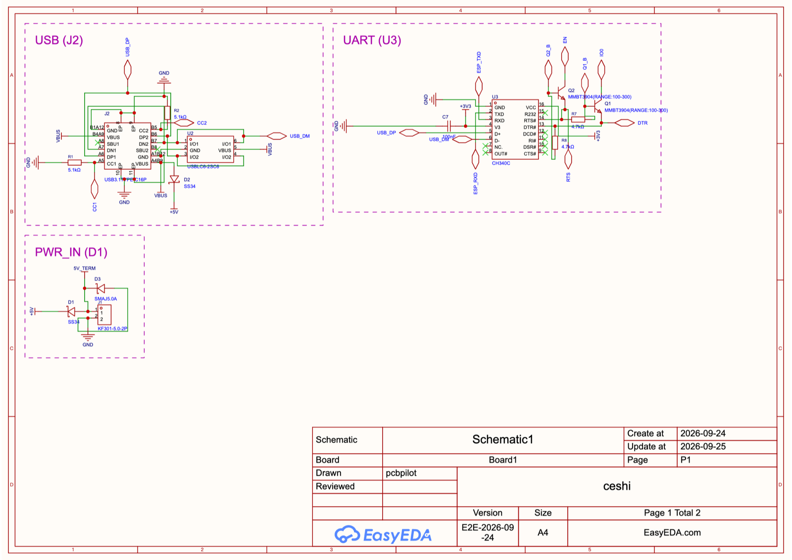
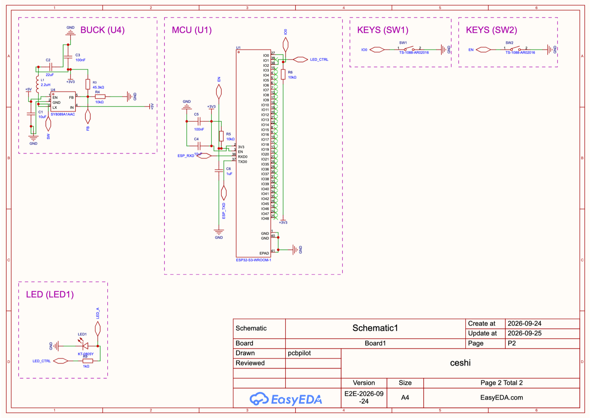
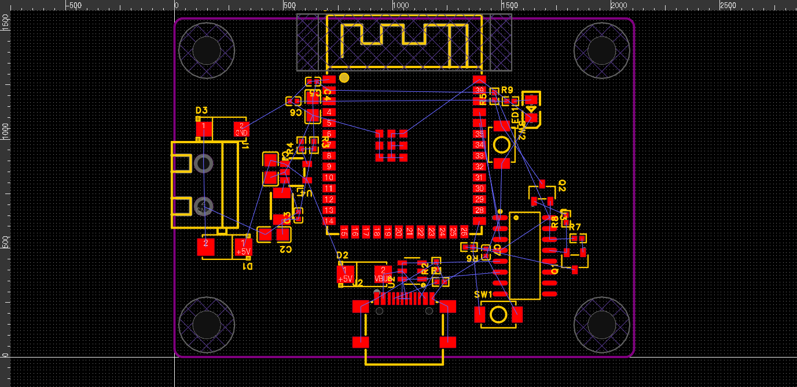
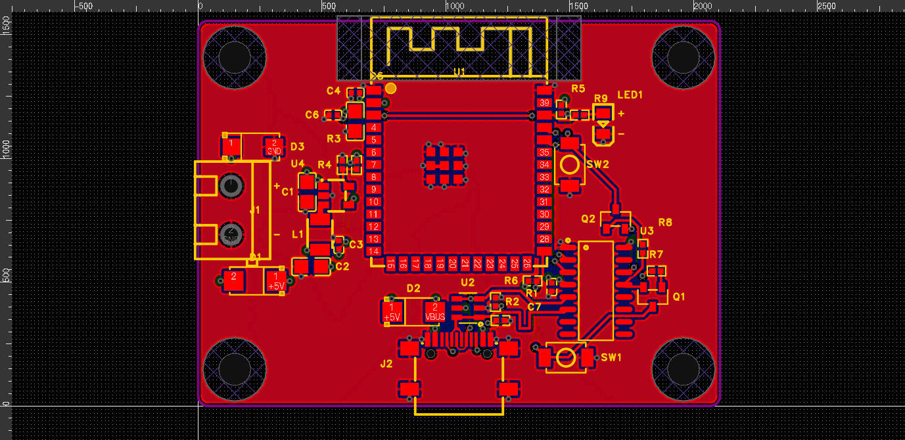

<p align="center">
  
</p>

<h1 align="center">pcbpilot</h1>

<p align="center">
  让 AI 直接操作嘉立创 EDA 专业版：读数据手册、画原理图、布局 PCB、整理丝印并完成检查。
</p>

<p align="center">
  <a href="https://github.com/zhuangzard/pcbpilot"><b>GitHub</b></a> ·
  <a href="docs/manual.md"><b>使用手册</b></a> ·
  <a href="docs/quick-start.md"><b>快速开始</b></a> ·
  <a href="README.en.md">English</a>
</p>


> **致谢与来源**：pcbpilot 由 [zhoushoujianwork/easyeda-agent](https://github.com/zhoushoujianwork/easyeda-agent)
> 分叉发展而来。CLI、daemon、连接器、typed action 体系、Skill、块库和大部分文档都出自原项目，
> 原作者与所有贡献者的提交历史完整保留在本仓库中，许可证为 MIT。衷心感谢原作者的工作。
> pcbpilot 在此基础上独立演进（首个新增能力是 `pcb auto` 电气感知整板自动设计引擎），
> 使用独立的命令名、端口段（61832–61841）、插件 uuid 与更新渠道，可与原版同时安装。

`pcbpilot` 是 EasyEDA Pro（嘉立创 EDA 专业版）的 AI 自动化层。你可以直接描述想做的
电路或要修的问题，Agent 会读取真实工程数据，通过官方 `eda.*` API 完成操作，并在写入前后
检查器件身份、引脚网络、几何、DRC 和保存状态。支持 **V3（3.2.x）与 V4**、桌面版与 Web 版、
国际版（pro.easyeda.com）与国内版（lceda.cn）。

## 它能做什么

| 使用场景 | 能力 |
|---|---|
| **拿 PDF / 尺寸图建库** | 读取型号、引脚和封装证据，创建 Symbol、Footprint、Device 和可选 3D Model；校验来源、焊盘依据和 pin↔pad 映射。[实战：AS07 私有库与框外丝印](docs/examples/as07-m1101d-sma/README.md) |
| **从需求做到一块板** | 从自然语言需求完成选型、原理图、分区布局、PCB、板框、叠层、布线、铺铜、丝印、DRC 和制造检查 |
| **原理图器件标准化** | 用 LCSC C 号或准确型号替换非标准器件，保留位号、位置和 PCB 同步身份；报告引脚差异并指导重新接线 |
| **原理图整理与修复** | 读取完整连接图，检查悬空、短路、跨页网名、NC、位号和模块归属，重新排版并回读验证 |
| **PCB 布局与布线** | `pcb auto` 整板引擎：机械约束 → 最小可行板框 → 原理图模块归属驱动的布局 → 多层协商布线 → 电源平面/分区铺铜 → 独立 DRC；天线净空、孔距、差分对、开关电源热回路 |
| **丝印调整** | 自动避开焊盘、器件体、禁区、板框和其他标签；添加板注、接口名、LED 极性及 SVG Logo |
| **复用成熟电路** | 从内置电路块库复用 CH340、ESP32 自动下载、按键、USB Hub、降压等拓扑，放件、连线并对账 |
| **检查与交付** | 原理图连接与几何检查、PCB DRC/DFM、BOM、网表、制造文件、截图、审计日志和显式保存 |

完整能力与状态见 [功能清单](docs/FEATURES.md)，命令索引见
[原理图 CLI](docs/cli/schematic.md) 和 [PCB CLI](docs/cli/pcb.md)。

## 直接这样告诉 Agent

安装完成后，不需要先学习 CLI。把需求和必要的文件交给支持 Skill 的 Agent，并明确使用
`pcbpilot`。

### 用 PDF 创建器件库

```text
请使用 pcbpilot，根据附件 ABC123.pdf 为完整型号 ABC123-QFN 建库。
先检查 EasyEDA 和 LCSC 库是否已有完全匹配的器件；没有再通读整份数据手册，核对订购
后缀、引脚表、封装尺寸图和推荐焊盘。自动创建 Symbol、Footprint 和 Device，保留证据页码，
先运行离线规格校验，再写入个人库。完成后回读 pin↔pad 映射并放置一个实例检查 Pin-1。
只有手册确实存在多个无法消歧的封装或缺少关键尺寸时再问我。
```

这个流程使用 `pcbpilot lib device validate --spec …` 在打开或修改 EasyEDA 前检查数据手册
证据、几何和引脚映射，再由 `lib device build` 创建完整资产。规格契约见
[数据手册驱动的自动建库](.agents/skills/pcbpilot/references/library-authoring.md)。

### 做一块 ESP32 最小系统板

```text
请使用 pcbpilot，在项目 ceshi 中完成一块 ESP32-S3-WROOM-1 最小系统板：
5V 端子输入，降压到 3V3，CH340 USB 下载，BOOT/RESET 按键，一颗 GPIO 控制的 LED，
四角 M3 固定孔。做 4 层板，GND 内电层，模组天线区域所有层 keepout。
请自行选型并核对数据手册，从原理图、布局、布线、铺铜、丝印一直做到 DRC 和保存完成。
```

完整实战与真实截图见
[一份需求文档 → ESP32-S3 四层板](docs/showcase-esp32-mini.md)。

### 调整当前 PCB 的丝印

```text
请使用 pcbpilot 检查当前 PCB 的全部位号和自由丝印。把压焊盘、超板框、重叠、
朝向不一致和底层未镜像的问题整理好；保留 LED 正负极、接口名称和必要板注。
完成后运行 pcb check 和官方 DRC，导出一张复核图并保存。
```

### 标准化原理图器件

```text
请使用 pcbpilot 扫描当前原理图，把无准确料号、非标准符号或封装不一致的器件列出来。
优先匹配标准器件库和准确 LCSC C 号，核对型号、封装及引脚后再替换。
替换时保留位号、位置和 uniqueId；如果 pinDiff 非空，修复接线并重新运行 sch check、
bridge-check 和官方 DRC。最后输出替换清单和仍无法确定的器件。
```

### 检查并修复已有工程

```text
请使用 pcbpilot 全面检查当前原理图和 PCB。先读取真实器件、引脚、网络、板框、叠层和
DRC 规则，再修复可以确定的问题。不要凭截图猜连接；所有修改完成后回读对账、运行连接/几何/DRC 检查、
保存，并把仍需人工决策的问题单独列出。
```

## 效果展示

### ESP32-S3 四层板：一句需求交给新 Agent，到 DRC 通过（v0.3.0，2026-09-25 实测）

输入只有 [esp32MiniRequire.md](esp32MiniRequire.md) 第一节的客户原始需求（不给 BOM、不给网表），交给一个
**没有任何上下文的新 Agent**，约 36 分钟自行完成：

- **原理图**：自行选型，画两页原理图（31 个器件、21 个网络，按功能模块加框），回读逐脚 0 差异，两页 strict gate 通过；
- **布局**：`pcb auto` 求出 53.5 × 39.5 mm 的最小板框，四角 M3，ESP32 天线独占上边并全层禁布，USB-C 贴下边外伸
  0.5 mm；原理图模块框决定 PCB 归属（降压电容跟降压芯片、EN 复位电容贴 EN 脚、ESD 贴 USB 口）；两轮自检
  （第 2 轮保存 → 重载 → 重读 → 重新出图）后进入布线；
- **布线**：4 层（TOP / IN1 GND 平面 / IN2 电源分区 / BOTTOM），信号 30/30、平面连接 54/54，综合分 92.3；
  原生 DRC 通过、`pcb check` 0 ERROR、丝印无重叠、逐焊盘对账 0 差异、保存重开后内容哈希不变；
- **反哺工具**：这一轮暴露的 11 个问题（USB-C 封装定位孔未建模、USB 差分线跨电源分割、丝印不收敛、
  按工程名检查误报等）全部修进仓库，并在同一块板上现场复测通过，随 v0.3.0 发布；
- 宿主：EasyEDA Pro **V3 3.2.149 桌面版**（国际版）。

| 原理图第 1 页（USB-C / CH340C 串口与自动下载 / 5V 输入） | 原理图第 2 页（降压 / ESP32-S3 / 按键 / LED） |
|---|---|
|  |  |

| 布局（两轮自检后、布线前） | 布线 + 铺铜 + 丝印（终检通过） |
|---|---|
|  |  |

过程、问题与修法见 [pcb-auto 实测记录](.agents/skills/pcbpilot/references/pcb-auto.md#实测记录)。

## 上游 easyeda-agent 的案例（分叉前）

以下三个案例由原项目作者 [zhoushoujian](https://github.com/zhoushoujianwork) 在分叉前完成，保留在此作为能力来源的记录。

### 从模块尺寸图到个人私有库

**需求：** 按用户提供的 AS07-M1101D-SMA 尺寸与引脚图创建个人库，原理图保持双排引脚的
左右顺序；封装标注引脚名和型号，丝印全部放在模块覆盖区域外，安装后仍可查看，并收紧、对齐。

**结果：** 已创建并保存 Symbol、Footprint 和 Device，核对 8 个引脚与 8 个通孔焊盘映射；
修正符号边框闭合和引脚方向。封装左侧用两列脚号＋名称，列间距约 0.5 mm，靠框一列距框
约 0.6 mm；型号居中放在框外上方，实际文字包围盒回读无重叠。
最终按用户要求使用普通引脚线和未定义类型，1 脚使用独立圆形标记；保留用户清理 NC 后的状态。


这次输入是用户尺寸图，不是完整原厂 PDF；焊盘与部分偏移采用明确假设计算。
尚未验证实物装配、放置实例和 PCB DRC，不作为生产就绪证明。
[查看原始需求图、封装预览、规格与回读结果](docs/examples/as07-m1101d-sma/README.md)。

### 嘉立创 PCB 初级考试第十八期：AT32F415 Layout

当前参数化 Layout 基线包含 69 个器件、15 个功能区和 90 × 50 mm 圆角板框，用于验证
“样例关系 → 算法候选 → AI 选择 → typed 写入 → 回读”的布局方法。该图展示布局阶段结果，
不代表整板布线或生产检查已经完成。

<p align="center">
  
</p>

标准考试来源：**嘉立创 PCB 初级考试题第十八期**。执行步骤、参数和验证边界见
[260919 AT32F415 考试执行指导](docs/260919-exam-execution-guide.md)。

### 数据驱动的原理图组合

Agent 先在本地连接数据中核对器件、引脚和网络，再计算模块内部布局并写回 EasyEDA；粉色虚线框
表示独立功能区，Apply 后逐脚回读，而不是仅凭截图判断成功。


## 安装与开始使用

pcbpilot 由四部分组成：`pcbpilot` CLI/daemon、运行在 EasyEDA 内的 **PCB Pilot Connector**
（`.eext`，侧载安装，不在插件市场）、AI 客户端里的 `pcbpilot` Skill，以及可选的 MCP 服务。

### 新机器：一句话交给 Claude

```text
克隆 https://github.com/zhuangzard/pcbpilot 并按仓库 AGENTS.md 的「新机器安装」完成 pcbpilot 安装，
最后告诉我需要我手动做的连接器导入步骤。
```

Agent 会运行 [`scripts/setup-agent.sh`](scripts/setup-agent.sh)：编译 CLI，为 **Claude Code / Codex / ZCode**
链接 Skill 并注册 MCP，构建连接器，把 daemon 装成开机登录自动启动的服务（必需，`pcbpilot daemon service install`），最后自动验证（MCP 真实握手）。若机器上装过上游
easyeda-agent，会移除其 MCP 并把其 Skill 移入可恢复的备份，避免与 pcbpilot 争用同类任务。也可以自己运行：

```bash
git clone https://github.com/zhuangzard/pcbpilot.git && cd pcbpilot
scripts/setup-agent.sh          # --dry-run 先预览；无 Go 时自动改用发布版
```

只装已发布版本（无需克隆）：

```bash
curl -fsSL https://raw.githubusercontent.com/zhuangzard/pcbpilot/main/install.sh | bash      # macOS / Linux
irm https://raw.githubusercontent.com/zhuangzard/pcbpilot/main/install.ps1 | iex             # Windows PowerShell
```

### 唯一的人工步骤：导入连接器

1. EasyEDA Pro → 扩展管理器 → 已安装：先**卸载**旧的 “PCB Pilot Connector”（同 uuid 不卸载会静默导入失败）；
2. 导入 `setup-agent.sh` 打印的 `.eext`，或 [Release](https://github.com/zhuangzard/pcbpilot/releases/latest) 里的 `pcbpilot-connector.eext`；
3. **高级 → 扩展管理器 → 已安装 → 选中 PCB Pilot Connector**（状态须为 `Enabled`）→ **Config** 页签 → 勾选 **允许外部交互**；
4. 重新加载编辑器（Web 刷新页面，桌面重开工程），然后：

```bash
pcbpilot health        # windows[] 出现你的工程和文档，connectorVersion 与仓库一致
```

完整安装、升级、MCP、排障见 **[使用手册](docs/manual.md)**。

## 为什么它适合 Agent

直接把任意 JavaScript 丢进编辑器很难审查，也难确认部分失败。pcbpilot 把常用能力封装成
有明确输入输出的 typed actions，并在工作流中加入：

- 写入前检查目标工程、页面、器件身份和源数据；
- 写入后回读引脚、网络、几何和对象绑定；
- 原理图 `layout-lint → check → bridge-check → DRC` 分项报告事实与差异；
- PCB 使用真实 DRC 规则完成布局、布线、铺铜和制造检查；
- 对部分成功、超时和无法确认的结果停止盲目重试；
- 自动保存作为安全网，关键节点仍显式保存。

```text
AI Agent / Skill
       │
       ▼
pcbpilot CLI + local daemon
       │ typed actions / audit / artifacts
       ▼
PCB Pilot Connector (.eext)
       │ official eda.* API
       ▼
EasyEDA Pro project
```

架构与协议细节见 [架构说明](docs/architecture.md) 和 [协议说明](docs/protocol.md)。

## 能力边界

- `pcb auto` 对中小型板可整板布通（ESP32 实测 100%）；大型 BGA 板（RK3568/K230 级）离线回归布通率 55–62%，
  适合作为起点，可选接外部 Freerouting。
- 连接器导入与“允许外部交互”需要人来做；Agent 不操作 EDA 的 GUI。
- EasyEDA 扩展 API 不提供编程式 undo，项目通过源数据、写前守卫、回读和失败回滚降低风险。
- 受控阻抗所需的介质厚度、Er 和铜厚无法从当前 `eda.*` API 完整读取，不能自动声称阻抗合格。
- PDF 自动建库仍以具体型号和原厂证据为准；扫描模糊、封装后缀不明或缺少焊盘依据时会暂停询问。

当前能力与边界见 [功能清单](docs/FEATURES.md) 和 [CLI 索引](docs/cli/README.md)。
过往调研和实测结果集中在 [历史证据索引](docs/reviews/README.md)。

## 开发与贡献

- 文档导航与信息归属：[docs/README.md](docs/README.md)
- 跨项目查询、维护 Skill 和多客户端兼容：[Agent 协作设计](docs/agent-collaboration.md)
- 开发环境：[docs/dev-environment.md](docs/dev-environment.md)
- 电路块贡献：[standard-blocks-contributing.md](.agents/skills/pcbpilot/references/standard-blocks-contributing.md)
- Skill 入口：[.agents/skills/pcbpilot/SKILL.md](.agents/skills/pcbpilot/SKILL.md)
- 仓库结构与开发约定：[AGENTS.md](AGENTS.md)

感谢嘉立创 EDA 专业版开放扩展接口，也感谢
[@jlceda/pro-api-types](https://www.npmjs.com/package/@jlceda/pro-api-types)、
[Freerouting](https://github.com/freerouting/freerouting) 及
[EasyEDA 官方开源扩展](https://github.com/easyeda) 提供的基础与参考。

## 许可证

[MIT](LICENSE)。`extension/src/beautify/` 中移植自
[Easy_EDA_PCB_Beautify](https://github.com/m-RNA/Easy_EDA_PCB_Beautify) 的文件沿用
Apache-2.0，详见 [NOTICE](NOTICE)。
