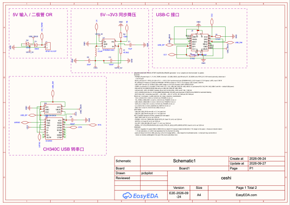
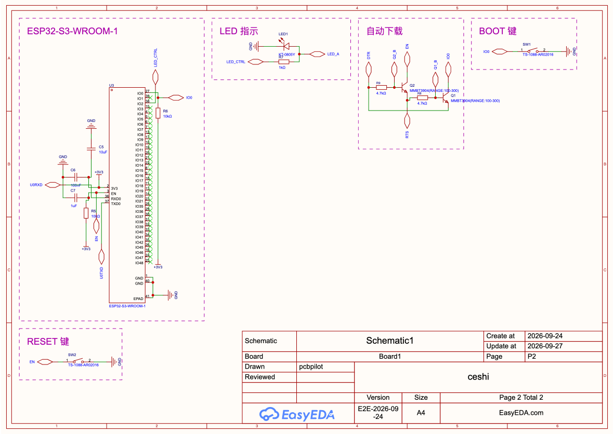
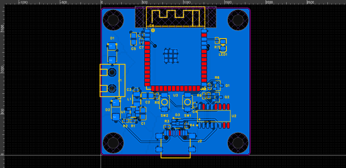
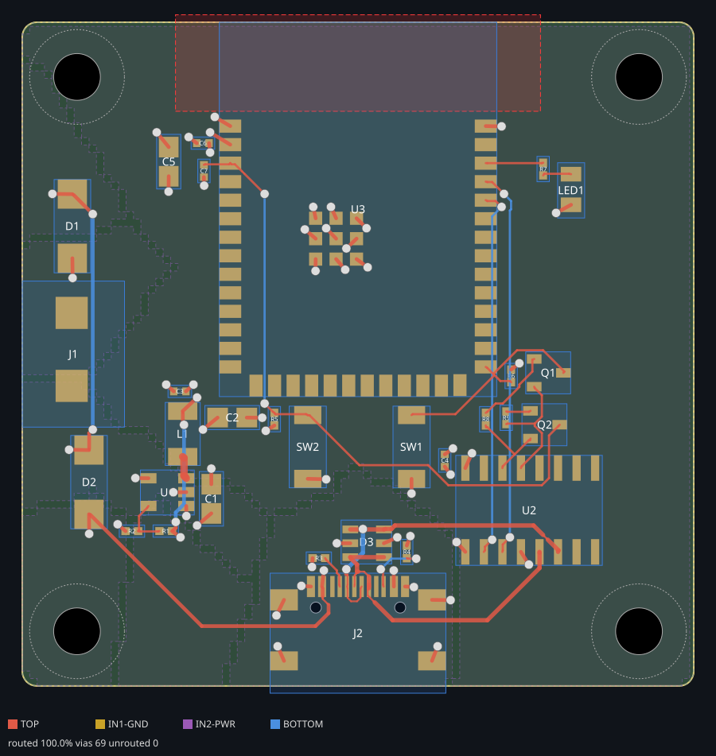
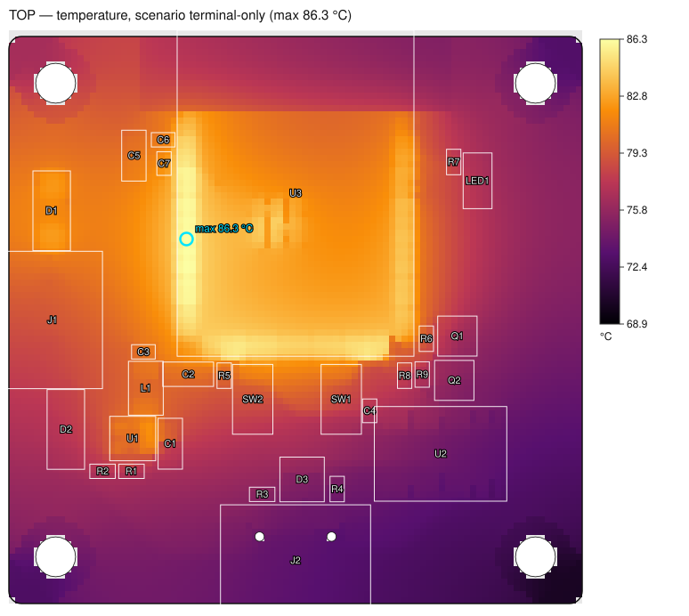
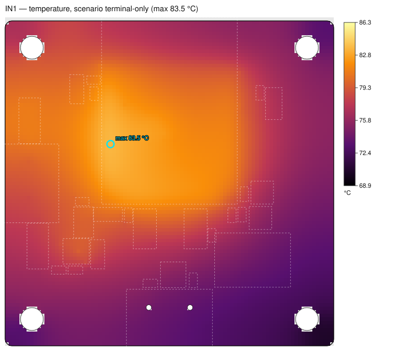
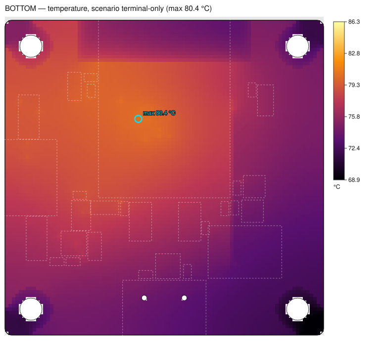
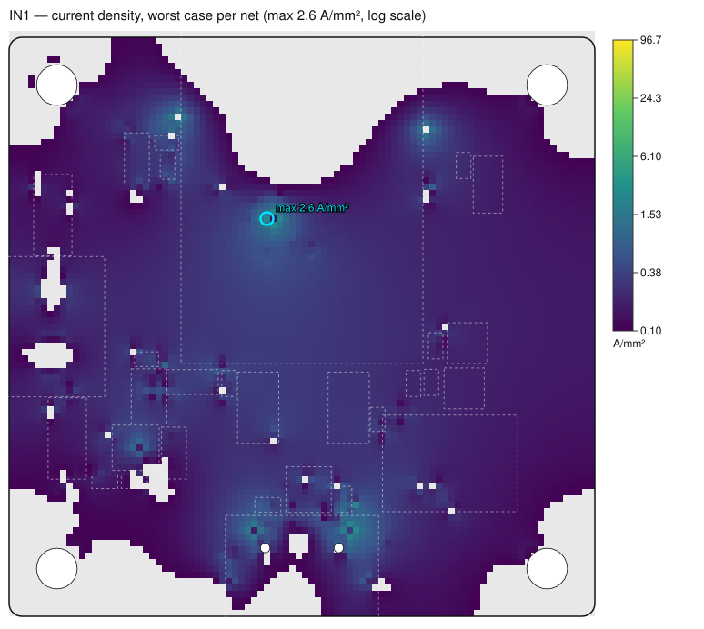
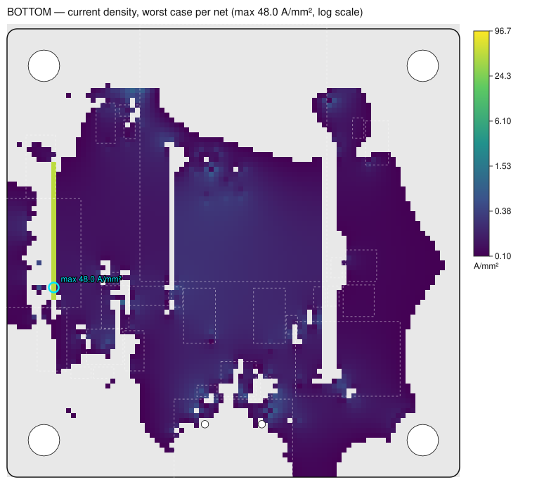

# ESP32-S3 mini 设计报告 v2

> **总体结论：FAIL** · 客户 Demo · 生成 2026-09-21T14:13:20Z · pcbpilot dev · 宿主 EasyEDA Pro desktop V3 3.2.149 · connector 0.4.1
>
> 输入摘要 `e1310e2aa47f22d88d35767ab465db069b5b922c0cd236c047fcc5388ecf7c60` · 相对 v1

**不通过原因**

- 2 项工程计算（线宽/过孔/间距/阻抗）不满足

**警告**

- intent 有 2 条 warn 级发现
- 1 个器件功率模型为假定值（assumed）
- 3 项器件余量低于准则
- 14 项器件额定需数据手册确认
- pcb check（DFM 重建审计）：ERROR 0 / WARN 100 / INFO 13

## 0 封面与输入来源

| 类型 | 说明 | 状态 | 路径 | sha256 |
|---|---|---|---|---|
| intent | 设计意图 intent.json | 已提供 | `examples/esp32-mini-design-report/inputs/intent-3v3-1A.json` | `0fe14f8bb769` |
| sim | 电源仿真 sim.json | 已提供 | `artifacts/v05-live/sim.json` | `c04bed826d61` |
| plan | pcb auto plan.json | 已提供 | `artifacts/v05-live/final/plan.json` | `82bfc1b79f39` |
| feedback | pcb auto feedback.json | 已提供 | `artifacts/v05-live/final/feedback.json` | `887905161e9a` |
| board | 板级回读 board dump | 已提供 | `artifacts/v05-live/final.after2.json` | `5de96657c297` |
| reload-board | 保存重载后回读 | 已提供 | `artifacts/v05-live/final.reload.json` | `51256aeb9120` |
| drc | 原生 DRC | 已提供 | `artifacts/v05-live/final.drc4.json` | `8d9b9c691219` |
| check | pcb check | 已提供 | `artifacts/v05-live/final.check2.txt` | `12174bf2fcb5` |
| rules-check | 规则同步 rules check | 已提供 | `artifacts/v05-live/rules-check.json` | `a9e2e056f938` |
| net-diff | 焊盘网络对账 | 已提供 | `artifacts/v05-live/netdiff.json` | `6931fd8912a9` |
| values | 器件值/型号 | 未提供 | `` | `` |
| models | 功率模型/额定 power-models.json | 已提供 | `.agents/skills/pcbpilot/references/power-models.json` | `8ac867b0ec7d` |
| post | 设计后仿真 post.json | 已提供 | `examples/esp32-mini-post-layout/post.json` | `507c486b7875` |
| spice | SPICE 网表 | 未提供 | `` | `` |
| image | 原理图 P1 | 已提供 | `artifacts/v05-live/sch-905bb85957eaf435.png` | `8a57cbdd3a56` |
| image | 原理图 P2 | 已提供 | `artifacts/v05-live/sch-950ae6609e91d753.png` | `b3c20ee5aa37` |
| image | PCB 布局（编辑器快照） | 已提供 | `artifacts/v05-live/snap/v05-final/snapshot.png` | `912dc6053d52` |
| image | pcb auto 离线布线预览（preview.svg） | 已提供 | `artifacts/v05-live/final/preview.svg` | `a0f25c3fdbc7` |
| image | TOP 温度（68.88–86.28 °C） | 已提供 | `examples/esp32-mini-post-layout/heatmaps/temp-TOP.svg` | `deae362a5890` |
| image | IN1 温度（68.88–86.28 °C） | 已提供 | `examples/esp32-mini-post-layout/heatmaps/temp-IN1.svg` | `4e7b8d550c58` |
| image | IN2 温度（68.88–86.28 °C） | 已提供 | `examples/esp32-mini-post-layout/heatmaps/temp-IN2.svg` | `0dc5728b3fcd` |
| image | BOTTOM 温度（68.88–86.28 °C） | 已提供 | `examples/esp32-mini-post-layout/heatmaps/temp-BOTTOM.svg` | `77ea8ebd5522` |
| image | TOP 电流密度（0.1–96.68 A/mm²） | 已提供 | `examples/esp32-mini-post-layout/heatmaps/current-TOP.svg` | `44589ccf1ce7` |
| image | IN1 电流密度（0.1–96.68 A/mm²） | 已提供 | `examples/esp32-mini-post-layout/heatmaps/current-IN1.svg` | `0af05c93bf22` |
| image | IN2 电流密度（0.1–96.68 A/mm²） | 已提供 | `examples/esp32-mini-post-layout/heatmaps/current-IN2.svg` | `6ea4e2573da2` |
| image | BOTTOM 电流密度（0.1–96.68 A/mm²） | 已提供 | `examples/esp32-mini-post-layout/heatmaps/current-BOTTOM.svg` | `312221df5d18` |

## 1 执行摘要

| 指标 | 数值 | 说明 |
|---|---|---|
| 板尺寸 | 46 × 45.5 mm | 4 层，30 个器件 |
| 电源轨 +3V3 | 3.318 V，最大 0.521 A | 最坏场景 peak |
| 电源轨 +5V_TERM | 4.999 V，最大 0.427 A | 最坏场景 terminal-only |
| 电源轨 USB_VBUS | 4.996 V，最大 0.43 A | 最坏场景 usb-only |
| 电源轨 VSYS_5V | 4.733 V，最大 0.43 A | 最坏场景 usb-only |
| 输入功率（typical） | 0.444 W | 负载 0.374 W，损耗 70.15 mW |
| 输入功率（peak） | 2.115 W | 负载 1.728 W，损耗 0.387 W |
| 最紧器件余量（相对准则） | 11.4 %（准则 ≥ 20 %） | L1 峰值电流 Ipk vs Isat |
| 器件检查 | 30 ok / 3 临界 / 0 超限 / 14 需数据手册 |  |
| 最坏 IR 压降 | 17.87 mV / 预算 99.9 mV（17.9 %） | USB_VBUS @ D2.2 |
| 布线完成率 | 100 % (30/30) |  |
| 原生 DRC（EasyEDA） | PASS | 原生 DRC 通过，0 违规；2026-09-28T04:00:20.47119Z |
| pcb check（DFM 重建审计） | WARN | ERROR 0 / WARN 100 / INFO 13 |
| 设计后最坏压降（真实铜皮） | 17.07 mV / 预算 99.1 mV | USB_VBUS @ D2.2（usb-only） |
| 设计后板最高温度 | 86.3 °C | 场景 terminal-only；TOP (561, 1151.6) mil，U3 下方 |
| 设计发现（intent） | 0 error / 2 warn / 4 info |  |

### 主要风险

| 级别 | 来源 | 内容 | 建议 |
|---|---|---|---|
| error | calculation | +3V3 线宽 10/10 mil（外/内）小于 1 A 所需 11.83/23.65 mil | 加宽该网络类线宽 / 改铺铜，或重新 intent derive 让规则跟随电流 |
| error | calculation | +3V3 每次换层 1 个过孔，1 A 需要 2 个 | 增加换层过孔数 |
| warn | intent:inductor-rating | [L1,U1] L1 (regulator U1) peak 0.682 A / RMS 0.53 A vs rated 0.77 A (power model nlcv32t-2r2m): 11% margin on the peak | choose an inductor rated ≥ 1.3× Ipk (saturation), or confirm Isat separately from the thermal Irms rating |
| warn | intent:usb-budget | [J2] J2 draws 0.43 A from USB (usb-only) vs the 0.5 A budget (86%) — little margin for inrush/radio bursts | a host port may current-limit or brown out; declare usbBudgetA in the spec if the source advertises more |
| warn | feasibility | D3 VRWM vs 最高线电压：余量 0.1 %（准则 ≥ 0 %） | 源规格上限 5.25 V > VRWM：高端漏电增加，请按数据手册核对 VBR/漏电 |
| warn | feasibility | L1 峰值电流 Ipk vs Isat：余量 11.4 %（准则 ≥ 20 %） |  |
| warn | feasibility | J2 供电预算 I vs 端口额定：余量 14 %（准则 ≥ 20 %） |  |
| info | feasibility | 14 项器件额定未知（需数据手册），未计入余量判定 | 在 power-models.json 的 ratings 中补充并注明来源 |

### 相对 v1 的变化

输入变化：变更 intent:设计意图 intent.json

| 指标 | 之前 | 之后 | 变化 |
|---|---|---|---|
| 意图电流 +3V3 | 0.521 A | 1 A | +0.479 A |
| 所需线宽 +3V3 | 4.82 mil | 11.83 mil | +7.01 mil |
| 总体结论 | PASS with warnings | FAIL |  |

- 新增问题：FAIL: +3V3 过孔 1 < 需要 2 @ 1 A
- 新增问题：FAIL: +3V3 线宽 10/10 mil（外/内）< 需要 11.83/23.65 mil @ 1 A

## 2 需求与设计意图

数据：[data/intent.json](data/intent.json)

| ID | 功能 | 核心 | 器件 | 说明 |
|---|---|---|---|---|
| POWER_IN | power-input / or-ing | J1 | J1, D1, D2 | J1 (+5V_TERM, terminal) + J2 (USB_VBUS, usb) OR-ed by D1, D2 (SS34) onto VSYS_5V; 0.43 A worst (usb-only), diode loss ≤ 0.157 W each |
| BUCK_3V3 | buck | U1 | U1, C1, L1, R1, R2 | VSYS_5V 4.59–4.73 V → +3V3 3.318 V synchronous buck (SY8089A1AAC), 0.521 A peak / 0.113 A typical, η 90%, loss 0.198 W |
| RF_MODULE | rf-module | U3 | U3, C3, C6 | ESP32-S3-WROOM-1 RF/MCU module on +3V3: 0.101 A typical, 0.501 A peak (1.659 W) |
| USB_UART | usb-uart | U2 | U2, C2, C4, C5 | CH340C USB↔UART bridge on +3V3 (20 mA peak); UART U0RXD/U0TXD |
| CONN_J2 | connector | J2 | J2, R3, R4 | J2 (USB3.1TYPE-C16P): CC1, CC2, USB_DM, USB_DP, USB_VBUS; CC pull-downs R3 5.1kΩ, R4 5.1kΩ (USB-C sink Rd → default USB power) |
| ESD | esd | D3 | D3 | D3 (USBLC6-2SC6) ESD array on USB_DM, USB_DP, USB_VBUS |
| LED | led | LED1 | LED1, R7 | LED1 (KT-0805Y) indicator driven from U3.IO2 (LED_CTRL) via R7 1kΩ, 1.399 mA |
| AUTO_DOWNLOAD | other / auto-download | Q1 | Q1, Q2, R8, R9 | Q1/Q2 (MMBT3904(RANGE:100-300)) auto-download: DTR/RTS drive EN/IO0 for automatic flashing |
| KEYS | other / keys | SW1 | SW1, C7, R5, R6, SW2 | momentary keys SW1 → IO0, SW2 → EN; C7 1uF RC, R5 10kΩ pull, R6 10kΩ pull |

| 电压域 | 类型 | 参考 | Vrms / Vpk | 网络 | 器件 |
|---|---|---|---|---|---|
| SELV_5V | SELV | GND | 4.999 / 4.999 | 21 | 30 |

| 安全设定 | 值 | 说明 |
|---|---|---|
| 安全标准 Standard | IPC-2221B | 工程默认值（规格书未声明） |
| 绝缘等级 Insulation | functional | 工程默认值（规格书未声明） |
| 污染等级 Pollution degree | PD2 | 工程默认值（规格书未声明） |
| 材料组 Material group | IIIa | 工程默认值（规格书未声明） |
| 海拔 Altitude | 2000 m | 工程默认值（规格书未声明） |
| 过电压类别 OVC | II | 工程默认值（规格书未声明） |
| 三防涂覆 Coated | 否 | 规格书声明 |

**设计发现**

| 级别 | 类型 | 内容 | 建议 |
|---|---|---|---|
| warn | intent:inductor-rating | [L1,U1] L1 (regulator U1) peak 0.682 A / RMS 0.53 A vs rated 0.77 A (power model nlcv32t-2r2m): 11% margin on the peak | choose an inductor rated ≥ 1.3× Ipk (saturation), or confirm Isat separately from the thermal Irms rating |
| warn | intent:usb-budget | [J2] J2 draws 0.43 A from USB (usb-only) vs the 0.5 A budget (86%) — little margin for inrush/radio bursts | a host port may current-limit or brown out; declare usbBudgetA in the spec if the source advertises more |
| info | intent:diode-loss | [D1] D1 (SS34) conducts 0.427 A: Vf ≈ 0.364 V, loss 0.155 W (terminal-only) | if the downstream headroom matters, an ideal-diode controller or P-MOSFET OR-ing removes most of this drop |
| info | intent:diode-loss | [D2] D2 (SS34) conducts 0.43 A: Vf ≈ 0.364 V, loss 0.157 W (usb-only) | if the downstream headroom matters, an ideal-diode controller or P-MOSFET OR-ing removes most of this drop |
| info | intent:impedance | impedance-controlled nets: USB_DM 90 Ω, USB_DP 90 Ω — order the board with the stackup the widths were solved for (JLC04161H-7628 (4-layer 1.6 mm, L1→L2 prepreg 0.2104 mm)) |  |
| info | intent:regulator-headroom | [U1] U1 buck: Vin min 4.593 V → 3.318 V, duty ≤ 82% |  |

## 3 电源仿真

数据：[data/sim.json](data/sim.json)

场景：typical、peak、buttons-pressed、terminal-only、usb-only；收敛：是。

| 网络 | 标称 V | 范围 V | typical A | peak A | buttons-pressed A | terminal-only A | usb-only A | 最大 A |
|---|---|---|---|---|---|---|---|---|
| +3V3 | 3.318 | 3.318–3.318 | 0.1135 | 0.5215 | 0.1141 | 0.5215 | 0.5215 | 0.5215 (peak) |
| +5V_TERM | 4.999 | 4.593–4.999 | 0.0462 | 0.2434 | 0.0464 | 0.4265 | 0 | 0.4265 (terminal-only) |
| USB_VBUS | 4.996 | 4.628–4.996 | 0.0428 | 0.1805 | 0.043 | 0 | 0.4298 | 0.4297 (usb-only) |
| VSYS_5V | 4.733 | 4.593–4.733 | 0.0889 | 0.4239 | 0.0895 | 0.4265 | 0.4298 | 0.4297 (usb-only) |

| 场景 | 输入功率 | 负载功率 | 损耗 | 整体效率 |
|---|---|---|---|---|
| typical | 0.444 W | 0.374 W | 70.15 mW | 84.2 % |
| peak | 2.115 W | 1.728 W | 0.387 W | 81.7 % |
| buttons-pressed | 0.447 W | 0.374 W | 72.79 mW | 83.7 % |
| terminal-only | 2.129 W | 1.728 W | 0.401 W | 81.2 % |
| usb-only | 2.13 W | 1.728 W | 0.402 W | 81.1 % |

| 器件 | 型号 | 模型 | 功耗 | 场景 |
|---|---|---|---|---|
| U3 | ESP32-S3-WROOM-1 | load | 1.659 W | peak |
| U1 | SY8089A1AAC | buck | 0.198 W | peak |
| D2 | SS34 | diode | 0.157 W | usb-only |
| D1 | SS34 | diode | 0.155 W | terminal-only |
| U2 | CH340C | load | 66.36 mW | peak |
| L1 | NLCV32T-2R2M-PF | inductor | 45.95 mW | peak |
| LED1 | KT-0805Y | led | 2.61 mW | typical |
| R7 | 0402WGF1001TCE | resistor | 1.96 mW | typical |
| R5 | 0402WGF1002TCE | resistor | 1.1 mW | buttons-pressed |
| R6 | 0402WGF1002TCE | resistor | 1.1 mW | buttons-pressed |
| R1 | 0402WGF4532TCE | resistor | 0.16 mW | typical |
| R2 | 0402WGF1002TCE | resistor | 0.04 mW | typical |

| 从 | 到 | 电源轨 |
|---|---|---|
| J1 | D1 | +5V_TERM 4.999 V / 0.427 A |
| J2 | D2 | USB_VBUS 4.996 V / 0.43 A |
| D1 | U1 | VSYS_5V 4.733 V / 0.43 A |
| D2 | U1 | VSYS_5V 4.733 V / 0.43 A |
| U1 | U2 | +3V3 3.318 V / 0.521 A |
| U1 | U3 | +3V3 3.318 V / 0.521 A |

**稳压器工作点**

| 器件 | 场景 | 模式 | Vin | Vout | Iout | Iin | D | η | 损耗 |
|---|---|---|---|---|---|---|---|---|---|
| U1 | typical | regulating | 4.733 | 3.337 | 0.1135 | 0.0889 | 0.779 | 90 % | 42.31 mW |
| U1 | peak | regulating | 4.656 | 3.406 | 0.5215 | 0.4239 | 0.792 | 90 % | 0.198 W |
| U1 | buttons-pressed | regulating | 4.733 | 3.337 | 0.1141 | 0.0895 | 0.779 | 90 % | 42.56 mW |
| U1 | terminal-only | regulating | 4.628 | 3.406 | 0.5215 | 0.4265 | 0.797 | 90 % | 0.198 W |
| U1 | usb-only | regulating | 4.593 | 3.406 | 0.5215 | 0.4297 | 0.803 | 90 % | 0.198 W |

U1（peak）计算过程：

- `Vout=0.6*(1+R1/R2)=3.318V on +3V3 (R1=45.3kΩ, R2=10kΩ)`
- `Iin=Vout·Iout/(η·Vin)+Iq=3.406·0.521/(0.90·4.656)+5e-05A=0.4239A`
- `D=Vout/(η·Vin)=0.792; ΔI=(Vin−Vout)·D/(L·fsw)=(4.656−3.318)·0.792/(2.2µH·1.5MHz)=0.321A; Ipk=0.682A Irms=0.530A`
- `input cap Irms=Iout·√(D(1−D))=0.212A (full value to each cap on VSYS_5V); output cap Irms=ΔI/(2√3)=0.0927A (each cap on +3V3)`
- `U1.IN (input pin) pulsed current Irms≈Iout·√D=0.464A, peak 0.682A`

**纹波电流**

| 对象 | 类型 | 稳压器 | ΔI | Ipk | Irms | Iavg | D | 场景 |
|---|---|---|---|---|---|---|---|---|
| C1 | capacitor | U1 | — | — | 0.2117 | — | — | peak |
| C2 | capacitor | U1 | — | — | 0.0964 | — | — | typical |
| C3 | capacitor | U1 | — | — | 0.0964 | — | — | typical |
| C4 | capacitor | U1 | — | — | 0.0964 | — | — | typical |
| C5 | capacitor | U1 | — | — | 0.0964 | — | — | typical |
| C6 | capacitor | U1 | — | — | 0.0964 | — | — | typical |
| L1 | inductor | U1 | 0.334 | 0.682 | 0.5296 | 0.5215 | 0.8027 | peak |
| LX | switch-node | U1 | 0.334 | 0.682 | 0.5296 | 0.5215 | 0.8027 | peak |

**模型可信度**：approx 5　assumed 1　datasheet 8　value 16　

| 器件 | 型号 | 模型 | 可信度 | 来源 |
|---|---|---|---|---|
| C1 | GRM21BR61H106KE43L | generic-capacitor | value |  |
| C2 | CL21A226MAQNNNE | generic-capacitor | value |  |
| C3 | CL05B104KO5NNNC | generic-capacitor | value |  |
| C4 | CL05B104KO5NNNC | generic-capacitor | value |  |
| C5 | GRM21BR61H106KE43L | generic-capacitor | value |  |
| C6 | CL05B104KO5NNNC | generic-capacitor | value |  |
| C7 | CL05A105KA5NQNC | generic-capacitor | value |  |
| D1 | SS34 | ss34 | approx | SS34 (3 A / 40 V Schottky) datasheets: VF 0.45–0.50 V at 3 A, ≈0.30 V at 0.1 A from the typical forward curve; two-point Shockley fit. |
| D2 | SS34 | ss34 | approx | SS34 (3 A / 40 V Schottky) datasheets: VF 0.45–0.50 V at 3 A, ≈0.30 V at 0.1 A from the typical forward curve; two-point Shockley fit. |
| D3 | USBLC6-2SC6 | usblc6-2sc6 | datasheet | ST USBLC6-2 datasheet: IRM ≤ 150 nA at VRM = 5 V (max, used for peak); typ 10 nA assumed. |
| J1 | KF301-5.0-2P | kf301-2p | **assumed** | 2-pin screw terminal used as a supply input: voltage from the net name (e.g. 5V_TERM → 5 V), else the default; 20 mΩ contact + short lead (assumed). |
| J2 | USB3.1TYPE-C16P | usb-c-receptacle | approx | USB 2.0/Type-C default VBUS 5.0 V (4.75–5.25 V). 0.1 Ω lumps cable + contact resistance (assumed). Shell/EP pins are not counted as return paths. |
| L1 | NLCV32T-2R2M-PF | nlcv32t-2r2m | datasheet | LCSC C250183 attributes (TDK NLCV32T-2R2M-PF, 1210 wire-wound 2.2 µH): DC Resistance 169 mΩ, Current Rating 770 mA. Compare the reported switch-node peak (ripple iPeakA) with the rating. |
| LED1 | KT-0805Y | kt-0805y | approx | Hubei KENTO KT-0805Y (yellow 0805) datasheet: VF 1.8–2.4 V (typ 2.0 V) at 20 mA, IF max 25 mA; ideality n=2 assumed for the knee. |
| Q1 | MMBT3904(RANGE:100-300) | mmbt3904 | datasheet | onsemi 2N3904/MMBT3904 SPICE model (IS=6.734f BF=416.4 BR=0.7371); IC max 200 mA. |
| Q2 | MMBT3904(RANGE:100-300) | mmbt3904 | datasheet | onsemi 2N3904/MMBT3904 SPICE model (IS=6.734f BF=416.4 BR=0.7371); IC max 200 mA. |
| R1 | 0402WGF4532TCE | generic-resistor | value |  |
| R2 | 0402WGF1002TCE | generic-resistor | value |  |
| R3 | 0402WGF5101TCE | generic-resistor | value |  |
| R4 | 0402WGF5101TCE | generic-resistor | value |  |
| R5 | 0402WGF1002TCE | generic-resistor | value |  |
| R6 | 0402WGF1002TCE | generic-resistor | value |  |
| R7 | 0402WGF1001TCE | generic-resistor | value |  |
| R8 | 0402WGJ0472TCE | generic-resistor | value |  |
| R9 | 0402WGJ0472TCE | generic-resistor | value |  |
| SW1 | TS-1088-AR02016 | ts-1088 | datasheet | XKB TS-1088 tactile switch: contact resistance ≤ 100 mΩ; momentary (open in typical, pressed in peak). |
| SW2 | TS-1088-AR02016 | ts-1088 | datasheet | XKB TS-1088 tactile switch: contact resistance ≤ 100 mΩ; momentary (open in typical, pressed in peak). |
| U1 | SY8089A1AAC | sy8089a | datasheet | Silergy SY8089A datasheet: VFB = 0.6 V, fsw = 1.5 MHz, IOUT 2 A, VIN 2.5–5.5 V, EN high ≥ 1.5 V; LCSC C479074 attributes: Quiescent Current 50 µA, Frequency 1.5 MHz. η ≈ 0.9 at 5 V→3.3 V / 0.3–1 A read from the efficiency curve (approx). |
| U2 | CH340C | ch340c | approx | WCH CH340 datasheet DC characteristics: operating supply current ≈ 12 mA typ while USB active; 20 mA used as peak. At 3.3 V V3 is tied to VCC (internal regulator bypassed), so only VCC is the supply pin. |
| U3 | ESP32-S3-WROOM-1 | esp32-s3-wroom-1 | datasheet | Espressif ESP32-S3-WROOM-1 datasheet v1.x: RF current table — Rx 802.11b/g/n ≈ 88–97 mA (typ 0.1 A used as Wi-Fi-connected average); Tx 802.11b 1 Mbps @ 21 dBm ≈ 355 mA; 'Power Supply' — the external supply should provide ≥ 0.5 A (peak 0.5 A used). GPIO max source 40 mA (ESP32-S3 series datasheet, DC characteristics). |

**假设**

- DC operating point (MNA + Newton-Raphson): capacitors open, inductors = DCR, switching regulators averaged by power balance; not a transient simulation
- IC signal pins are high-impedance (no DC drive) unless a GPIO drives an LED network
- loads are constant-current above a knee voltage and resistive below it (unpowered rails draw nothing)
- J1: input source +5V_TERM = 5.00 V (net name) with 0.02 Ω series resistance
- J2: input source USB_VBUS = 5.00 V (model) with 0.1 Ω series resistance
- momentary switches are released (open) except in buttons-pressed
- U3.IO2 (LED_CTRL) assumed driven high (LED1 on) through 40 Ω output resistance
- SW1 closed: momentary switch pressed in buttons-pressed
- SW2 closed: momentary switch pressed in buttons-pressed
- J2 (usb) disconnected in terminal-only
- J1 (terminal) disconnected in usb-only

## 4 器件可行性

统计：满足 30 · 临界 3 · 超限 0 · 需数据手册 14

| 器件 | 型号 | 检查项 | 应力 | 额定 | 余量 | 准则 | 结论 | 额定来源 / 备注 |
|---|---|---|---|---|---|---|---|---|
| C1 | GRM21BR61H106KE43L | 直流电压 V vs 额定 (10 µF X5R 0805) | 4.7331 V | 50 V | 90.5 % | ≥ 33.3 % | 满足 | Murata GRM part number |
| C1 | GRM21BR61H106KE43L | 纹波电流 Irms (稳压器 U1 @peak) | 0.2117 A | — | — | ≥ 20 % | 需数据手册 | 需数据手册（MLCC 纹波额定按自发热 ΔT≤20 °C 曲线查询） |
| C2 | CL21A226MAQNNNE | 直流电压 V vs 额定 (22 µF X5R 0805) | 3.318 V | 25 V | 86.7 % | ≥ 33.3 % | 满足 | Samsung CL part number |
| C2 | CL21A226MAQNNNE | 纹波电流 Irms (稳压器 U1 @typical) | 0.0964 A | — | — | ≥ 20 % | 需数据手册 | 需数据手册（MLCC 纹波额定按自发热 ΔT≤20 °C 曲线查询） |
| C3 | CL05B104KO5NNNC | 直流电压 V vs 额定 (100 nF X7R 0402) | 3.318 V | 16 V | 79.3 % | ≥ 33.3 % | 满足 | Samsung CL part number |
| C3 | CL05B104KO5NNNC | 纹波电流 Irms (稳压器 U1 @typical) | 0.0964 A | — | — | ≥ 20 % | 需数据手册 | 需数据手册（MLCC 纹波额定按自发热 ΔT≤20 °C 曲线查询） |
| C4 | CL05B104KO5NNNC | 直流电压 V vs 额定 (100 nF X7R 0402) | 3.318 V | 16 V | 79.3 % | ≥ 33.3 % | 满足 | Samsung CL part number |
| C4 | CL05B104KO5NNNC | 纹波电流 Irms (稳压器 U1 @typical) | 0.0964 A | — | — | ≥ 20 % | 需数据手册 | 需数据手册（MLCC 纹波额定按自发热 ΔT≤20 °C 曲线查询） |
| C5 | GRM21BR61H106KE43L | 直流电压 V vs 额定 (10 µF X5R 0805) | 3.318 V | 50 V | 93.4 % | ≥ 33.3 % | 满足 | Murata GRM part number |
| C5 | GRM21BR61H106KE43L | 纹波电流 Irms (稳压器 U1 @typical) | 0.0964 A | — | — | ≥ 20 % | 需数据手册 | 需数据手册（MLCC 纹波额定按自发热 ΔT≤20 °C 曲线查询） |
| C6 | CL05B104KO5NNNC | 直流电压 V vs 额定 (100 nF X7R 0402) | 3.318 V | 16 V | 79.3 % | ≥ 33.3 % | 满足 | Samsung CL part number |
| C6 | CL05B104KO5NNNC | 纹波电流 Irms (稳压器 U1 @typical) | 0.0964 A | — | — | ≥ 20 % | 需数据手册 | 需数据手册（MLCC 纹波额定按自发热 ΔT≤20 °C 曲线查询） |
| C7 | CL05A105KA5NQNC | 直流电压 V vs 额定 (1 µF X5R 0402) | 3.318 V | 25 V | 86.7 % | ≥ 33.3 % | 满足 | Samsung CL part number |
| D1 | SS34 | 正向电流 If vs 额定 (Vf≈0.364 V, P 0.155 W @terminal-only) | 0.4265 A | 3 A | 85.8 % | ≥ 20 % | 满足 | power-models.json ss34 (approx) |
| D1 | SS34 | 反向电压 VR vs VRRM (输入 J1 拔出时阳极按 0 V：VR = V(VSYS_5V)max) | 4.7331 V | 40 V | 88.2 % | ≥ 20 % | 满足 | ratings.vrrmV — SS34 datasheets: VRRM 40 V (3 A / 40 V Schottky) |
| D1 | SS34 | 耗散功率 P | 0.1552 W | — | — | ≥ 20 % | 需数据手册 | 需数据手册（封装热阻/功率降额） |
| D2 | SS34 | 正向电流 If vs 额定 (Vf≈0.364 V, P 0.157 W @usb-only) | 0.4298 A | 3 A | 85.7 % | ≥ 20 % | 满足 | power-models.json ss34 (approx) |
| D2 | SS34 | 反向电压 VR vs VRRM (输入 J2 拔出时阳极按 0 V：VR = V(VSYS_5V)max) | 4.7331 V | 40 V | 88.2 % | ≥ 20 % | 满足 | ratings.vrrmV — SS34 datasheets: VRRM 40 V (3 A / 40 V Schottky) |
| D2 | SS34 | 耗散功率 P | 0.1565 W | — | — | ≥ 20 % | 需数据手册 | 需数据手册（封装热阻/功率降额） |
| D3 | USBLC6-2SC6 | VRWM vs 最高线电压 (最高网络 USB_VBUS) | 4.9957 V | 5 V | 0.1 % | ≥ 0 % | 临界 | ratings.vrwmV — ST USBLC6-2 datasheet: VRM (reverse stand-off) 5 V；源规格上限 5.25 V > VRWM：高端漏电增加，请按数据手册核对 VBR/漏电 |
| J1 | KF301-5.0-2P | 接触电流 vs 额定 | 0.4265 A | — | — | ≥ 20 % | 需数据手册 | 需数据手册（额定值未知，不做猜测） |
| J2 | USB3.1TYPE-C16P | 接触电流 vs 额定 | 0.4298 A | — | — | ≥ 20 % | 需数据手册 | 需数据手册（额定值未知，不做猜测） |
| J2 | USB3.1TYPE-C16P | 供电预算 I vs 端口额定 | 0.4298 A | 0.5 A | 14 % | ≥ 20 % | 临界 | ratings.sourceBudgetA — USB 2.0: VBUS 4.75–5.25 V; default (non-negotiated) USB 2.0 port current 500 mA |
| L1 | NLCV32T-2R2M-PF | 峰值电流 Ipk vs Isat (ΔI 0.334 A, D 0.803 @peak) | 0.682 A | 0.77 A | 11.4 % | ≥ 20 % | 临界 | power-models.json nlcv32t-2r2m (datasheet) maxA（单一 Current Rating） |
| L1 | NLCV32T-2R2M-PF | 有效值 Irms vs Irated | 0.5296 A | 0.77 A | 31.2 % | ≥ 20 % | 满足 | power-models.json nlcv32t-2r2m (datasheet) maxA |
| LED1 | KT-0805Y | 正向电流 If vs IF,max | 0.0014 A | 0.025 A | 94.4 % | ≥ 20 % | 满足 | power-models.json kt-0805y (approx) |
| Q1 | MMBT3904(RANGE:100-300) | 集电极电流 Ic vs IC,max | 0 A | 0.2 A | 100 % | ≥ 20 % | 满足 | power-models.json mmbt3904 (datasheet) |
| Q2 | MMBT3904(RANGE:100-300) | 集电极电流 Ic vs IC,max | 0 A | 0.2 A | 100 % | ≥ 20 % | 满足 | power-models.json mmbt3904 (datasheet) |
| R1 | 0402WGF4532TCE | 功率 P vs 封装额定 (45.3 kΩ @typical) | 0.000163 W | 0.0625 W | 99.7 % | ≥ 50 % | 满足 | 0402 通用厚膜额定（70 °C）；UNI-ROYAL part number |
| R2 | 0402WGF1002TCE | 功率 P vs 封装额定 (10 kΩ @typical) | 3.6e-05 W | 0.0625 W | 99.9 % | ≥ 50 % | 满足 | 0402 通用厚膜额定（70 °C）；UNI-ROYAL part number |
| R3 | 0402WGF5101TCE | 功率 P vs 封装额定 (5.1 kΩ @typical) | 0 W | 0.0625 W | 100 % | ≥ 50 % | 满足 | 0402 通用厚膜额定（70 °C）；UNI-ROYAL part number；P = I²R（仿真未给功率） |
| R4 | 0402WGF5101TCE | 功率 P vs 封装额定 (5.1 kΩ @typical) | 0 W | 0.0625 W | 100 % | ≥ 50 % | 满足 | 0402 通用厚膜额定（70 °C）；UNI-ROYAL part number；P = I²R（仿真未给功率） |
| R5 | 0402WGF1002TCE | 功率 P vs 封装额定 (10 kΩ @buttons-pressed) | 0.0011 W | 0.0625 W | 98.2 % | ≥ 50 % | 满足 | 0402 通用厚膜额定（70 °C）；UNI-ROYAL part number |
| R6 | 0402WGF1002TCE | 功率 P vs 封装额定 (10 kΩ @buttons-pressed) | 0.0011 W | 0.0625 W | 98.2 % | ≥ 50 % | 满足 | 0402 通用厚膜额定（70 °C）；UNI-ROYAL part number |
| R7 | 0402WGF1001TCE | 功率 P vs 封装额定 (1 kΩ @typical) | 0.002 W | 0.0625 W | 96.9 % | ≥ 50 % | 满足 | 0402 通用厚膜额定（70 °C）；UNI-ROYAL part number |
| R8 | 0402WGJ0472TCE | 功率 P vs 封装额定 (4.7 kΩ @typical) | 0 W | 0.0625 W | 100 % | ≥ 50 % | 满足 | 0402 通用厚膜额定（70 °C）；UNI-ROYAL part number；P = I²R（仿真未给功率） |
| R9 | 0402WGJ0472TCE | 功率 P vs 封装额定 (4.7 kΩ @typical) | 0 W | 0.0625 W | 100 % | ≥ 50 % | 满足 | 0402 通用厚膜额定（70 °C）；UNI-ROYAL part number；P = I²R（仿真未给功率） |
| SW1 | TS-1088-AR02016 | 触点电流 vs 额定 | 0.000332 A | — | — | ≥ 20 % | 需数据手册 | 需数据手册（额定值未知，不做猜测） |
| SW2 | TS-1088-AR02016 | 触点电流 vs 额定 | 0.000332 A | — | — | ≥ 20 % | 需数据手册 | 需数据手册（额定值未知，不做猜测） |
| U1 | SY8089A1AAC | 输出电流 Iout vs 额定 (@peak) | 0.5215 A | 2 A | 73.9 % | ≥ 20 % | 满足 | power-models.json sy8089a (datasheet) |
| U1 | SY8089A1AAC | 输入电压 Vin,max vs 绝对/推荐上限 | 4.7331 V | 5.5 V | 13.9 % | ≥ 10 % | 满足 | ratings.vinMaxV — Silergy SY8089A datasheet: input voltage range 2.5–5.5 V |
| U1 | SY8089A1AAC | 输入电压 Vin,min vs 最低工作电压 | 4.5928 V | 2.5 V | 45.6 % | ≥ 20 % | 满足 | power-models.json sy8089a (datasheet) vinMinV |
| U1 | SY8089A1AAC | 结温 Tj = Ta + P·θJA (损耗 P（结温需 θJA）) | 0.1976 W | — | — | ≥ 20 % | 需数据手册 | 需数据手册（θJA / Tj,max） |
| U2 | CH340C | 供电 +3V3 电压范围 | 3.318 V | — | — | ≥ 3 % | 需数据手册 | 需数据手册（推荐工作电压范围） |
| U3 | ESP32-S3-WROOM-1 | 供电 +3V3 Vmax vs 推荐上限 | 3.318 V | 3.6 V | 7.8 % | ≥ 3 % | 满足 | ratings.vccMaxV — Espressif ESP32-S3-WROOM-1 datasheet, recommended operating conditions: VDD33 3.0–3.6 V |
| U3 | ESP32-S3-WROOM-1 | 供电 +3V3 Vmin vs 推荐下限 | 3.318 V | 3 V | 9.6 % | ≥ 3 % | 满足 | ratings.vccMinV — Espressif ESP32-S3-WROOM-1 datasheet, recommended operating conditions: VDD33 3.0–3.6 V |
| U3 | ESP32-S3-WROOM-1 | GPIO IO2 (LED_CTRL) 输出电流 | 0.0014 A | 0.04 A | 96.5 % | ≥ 20 % | 满足 | power-models.json esp32-s3-wroom-1 (datasheet) gpioMaxA |

| 对象 | 准则 | 说明 |
|---|---|---|
| 电流（电感/稳压器/二极管/LED/BJT/连接器） | 余量 ≥ 20 % | margin = (额定 − 应力)/额定 |
| 电感 Ipk | Isat ≥ 1.3 × Ipk 更稳妥 | 库中只有单一 Current Rating 时同时比较 Ipk 与 Irms |
| 电阻功率 | P ≤ 50 % 额定（70 °C 额定值） | 0402 1/16 W、0603 1/10 W、0805 1/8 W、1206 1/4 W（通用厚膜） |
| MLCC 直流电压 | 额定 ≥ 1.5 × 工作电压（余量 ≥ 33 %） | X5R/X7R < 2× 时须查 DC 偏压容量曲线 |
| ESD/TVS | VRWM ≥ 线上最高工作电压 | 余量 ≥ 0 即通过 |
| 供电范围 | 工作电压距推荐范围边界 ≥ 3 % | 下限 margin = (V − Vmin)/V |
| 结温 | Tj ≤ 80 % Tj,max | Tj = Ta + P·θJA，θJA 未知 → 需数据手册 |
| 未知额定 | 标记“需数据手册” | 绝不猜测额定值 |

## 5 工程计算

| 基础 | 值 |
|---|---|
| 外层/内层铜厚 | 1 oz (1.378 mil) / 0.5 oz (0.689 mil) |
| 允许温升 ΔT | 10 °C |
| 叠层 | JLC04161H-7628 (4-layer 1.6 mm, L1→L2 prepreg 0.2104 mm) |
| 外层→参考平面 h | 8.4 mil |
| 介电常数 εr | 4.05 |
| 工艺最小线宽/间距 | 6 / 6 mil |

| 项目 | 公式 | 依据 |
|---|---|---|
| IPC-2221/2152 载流 | `I = 0.048 · ΔT^0.44 · A^0.725，A = w · t（mil²）；内层按 IPC-2152 用同一曲线、内层铜厚` | IPC-2221B §6.2 外层曲线；IPC-2152 内外层同截面载流相近（与 intent/pcbauto 一致） |
| 单过孔载流 | `I = 0.024 · ΔT^0.44 · (π·(d+t)·t)^0.725，镀铜 t = 0.7 mil` | 孔壁按内层导体计 |
| 电压间距 | `IPC-2221B 表 6-1（B1 内层 / B2 外层未涂覆 / B4 涂覆），与工艺最小间距取大` |  |
| 微带线 Z0 | `Hammerstad–Jensen（含铜厚修正）` | pkg/pcbauto MicrostripZ0 |
| 差分 Zdiff | `Zdiff ≈ 2·Z0·(1 − 0.48·e^(−0.96·s/h))` | 边耦合微带近似 |
| 爬电/电气间隙 | `IEC 62368-1 / 60601-1 / 61010-1 表格或 IPC-2221B（按 intent.standard）` | pkg/safety；工程参考，最终以认证机构为准 |

> pcb auto 叠层参数 εr 4.4 / h 8.28 mil 与 intent（εr 4.05 / h 8.4 mil）不同：阻抗线宽按 intent 求解，下单叠层须与 intent 一致

**载流线宽**

| 网络 | 类 | 电流 A | 来源 | 外层需/计划 mil | 内层需/计划 mil | 外层载流 A | 结论 |
|---|---|---|---|---|---|---|---|
| +3V3 | POWER | 1 | declared | 11.83 / 10 | 23.65 / 10 | 0.886 | FAIL |
| LX | SWITCH | 0.5296 | simulated | 4.92 / 20 | 9.84 / 20 | 1.464 | PASS |
| GND | GND | 0.5215 | simulated | 4.82 / 10 | 9.63 / 10 | 0.886 | PASS |
| USB_VBUS | POWER | 0.4298 | simulated | 3.69 / 10 | 7.38 / 10 | 0.886 | PASS |
| VSYS_5V | POWER | 0.4298 | simulated | 3.69 / 10 | 7.38 / 10 | 0.886 | PASS |
| +5V_TERM | POWER | 0.4265 | simulated | 3.65 / 10 | 7.3 / 10 | 0.886 | PASS |

**过孔**

| 网络 | 电流 A | 钻孔 mil | 单孔 A | 需要 | 计划 | 结论 |
|---|---|---|---|---|---|---|
| +3V3 | 1 | 12 | 0.739 | 2 | 1 | FAIL |
| LX | 0.5296 | 12 | 0.739 | 1 | 1 | PASS |
| GND | 0.5215 | 12 | 0.739 | 1 | 1 | PASS |
| USB_VBUS | 0.4298 | 12 | 0.739 | 1 | 1 | PASS |
| VSYS_5V | 0.4298 | 12 | 0.739 | 1 | 1 | PASS |
| +5V_TERM | 0.4265 | 12 | 0.739 | 1 | 1 | PASS |

**电压间距**

| 网络 | Vpk | IPC mil | 工艺 mil | 计划 mil | 决定因素 | 结论 |
|---|---|---|---|---|---|---|
| +3V3 | 3.318 | 3.94 | 6 | 6 | 工艺最小值 | PASS |
| +5V_TERM | 4.999 | 3.94 | 6 | 6 | 工艺最小值 | PASS |
| GND | 0 | 3.94 | 6 | 6 | 工艺最小值 | PASS |
| LX | 4.733 | 3.94 | 6 | 6 | 工艺最小值 | PASS |
| USB_DM | 4.996 | 3.94 | 6 | 6 | 工艺最小值 | PASS |
| USB_DP | 4.996 | 3.94 | 6 | 6 | 工艺最小值 | PASS |
| USB_VBUS | 4.996 | 3.94 | 6 | 6 | 工艺最小值 | PASS |
| VSYS_5V | 4.733 | 3.94 | 6 | 6 | 工艺最小值 | PASS |

**阻抗**

| 类 | 网络 | 类型 | w | gap | h | t | εr | Z0 | Zdiff | 目标 | 偏差 | 结论 |
|---|---|---|---|---|---|---|---|---|---|---|---|---|
| HS_DIFF | USB_DM, USB_DP | diff | 11.7 | 6 | 8.4 | 1.378 | 4.05 | 59.1 | 89.7 | 90 | -0.4 % | PASS |

无绝缘对（单一电压域）。

## 6 布局与布线

*原理图 P1（已缩小）*

*原理图 P2（已缩小）*

*PCB 布局（编辑器快照）（已缩小）*

*pcb auto 离线布线预览（preview.svg）*

*TOP 温度（68.88–86.28 °C）*

*IN1 温度（68.88–86.28 °C）*

*IN2 温度（68.88–86.28 °C）*

*BOTTOM 温度（68.88–86.28 °C）*

*TOP 电流密度（0.1–96.68 A/mm²）*

*IN1 电流密度（0.1–96.68 A/mm²）*

*IN2 电流密度（0.1–96.68 A/mm²）*

*BOTTOM 电流密度（0.1–96.68 A/mm²）*

**叠层 JLC04161H-7628**

| 层 | 名称 | 类型 | 网络 | 方向 |
|---|---|---|---|---|
| 1 | TOP | signal |  | h |
| 15 | IN1-GND | plane | GND |  |
| 16 | IN2-PWR | plane | +3V3, VSYS_5V, USB_VBUS, +5V_TERM |  |
| 2 | BOTTOM | signal | GND | v |

| 布线统计 | 值 |
|---|---|
| 信号连接完成率 | 100 % (30/30) |
| 未布通 | 0 |
| 信号过孔 / 扇出过孔 | 14 / 55 |
| 布线总长 | 9.65 in |
| 迭代 / 剩余冲突 | 7 / 0 |
| 引擎内 DRC | 0 违规 / 459 项检查 |

**直流压降（预算 2 % 或 30 mV 取大（场景 worst））**

| 网络 | V | I | 供电 | 最坏 mV | 预算 mV | 占比 | 最坏焊盘 | 状态 |
|---|---|---|---|---|---|---|---|---|
| +3V3 | 3.318 | 0.5215 | L1 | 3.828 | 66.36 | 5.8 % | U3.2 | ok |
| +5V_TERM | 4.999 | 0.4265 | J1 | 1.98 | 99.98 | 2 % | D1.2 | ok |
| GND | 0 | 0.5215 | J2\|J1 | 1.118 | — | — | U3.1 | info |
| LX | 3.337 | 0.5296 | U1 | 0.614 | — | — | L1.1 | info |
| USB_VBUS | 4.996 | 0.4298 | J2 | 17.873 | 99.91 | 17.9 % | D2.2 | ok |
| VSYS_5V | 4.733 | 0.4298 | D2\|D1 | 15.617 | 94.66 | 16.5 % | U1.4 | ok |

最坏路径 +3V3 → U3.2（3.828 mV）：track 10.0 mil × 53 mil (fanout) 0.578 mV → via via(471,778) 0.225 mV → plane sheet 0.945 mV → via via(507,1494) 0.51 mV → track 10.0 mil × 64 mil (fanout) 1.57 mV

最坏路径 +5V_TERM → D1.2（1.98 mV）：plane sheet 0.429 mV → via via(136,1101) 0.434 mV → track 10.0 mil × 53 mil (fanout) 1.116 mV

最坏路径 GND → U3.1（1.118 mV）：track 10.0 mil × 26 mil (fanout) 0.263 mV → via via(753,270) 0.176 mV → plane sheet 0.135 mV → via via(519,1536) 0.148 mV → track 10.0 mil × 48 mil (fanout) 0.396 mV

最坏路径 LX → L1.1（0.614 mV）：track 20.0 mil × 48 mil (route) 0.614 mV

最坏路径 USB_VBUS → D2.2（17.873 mV）：track 5.0 mil × 3 mil (route) 0.135 mV → track 5.0 mil × 18 mil (route) 0.764 mV → track 10.0 mil × 22 mil (route) 0.472 mV → track 10.0 mil × 50 mil (route) 1.05 mV → track 10.0 mil × 307 mil (route) 6.479 mV → track 10.0 mil × 425 mil (route) 8.972 mV

最坏路径 VSYS_5V → U1.4（15.617 mV）：track 10.0 mil × 72 mil (route) 0.792 mV → via via(190,1274) 0.445 mV → track 10.0 mil × 582 mil (route) 12.284 mV → via via(190,692) 0.219 mV → plane sheet 0.7 mV → via via(305,561) 0.437 mV → track 10.0 mil × 35 mil (fanout) 0.741 mV

压降最大的 20 段（共 87 段）：

| 网络 | 层 | 类型 | 长 mil | I A | 布线宽 | 收窄后 | 需要 | 压降 mV |
|---|---|---|---|---|---|---|---|---|
| VSYS_5V | 2 | route | 581.7 | 0.4297 | 10 | 10 | 10 | 12.284 |
| USB_VBUS | 1 | route | 424.9 | 0.4298 | 10 | 10 | 10 | 8.9724 |
| USB_VBUS | 1 | route | 306.8 | 0.4298 | 10 | 10 | 10 | 6.4795 |
| +3V3 | 1 | fanout | 63.7 | 0.5014 | 10 | 10 | 10 | 1.57 |
| +5V_TERM | 1 | fanout | 53.3 | 0.4265 | 10 | 10 | 10 | 1.1165 |
| USB_VBUS | 1 | route | 49.7 | 0.4298 | 10 | 10 | 10 | 1.05 |
| VSYS_5V | 1 | route | 72.3 | 0.2228 | 10 | 10 | 10 | 0.7917 |
| USB_VBUS | 1 | route | 18.1 | 0.4298 | 5 | 5 | 10 | 0.7636 |
| VSYS_5V | 1 | fanout | 35.1 | 0.4297 | 10 | 10 | 10 | 0.7405 |
| LX | 1 | route | 47.9 | 0.5215 | 20 | 20 | 20 | 0.6142 |
| +3V3 | 1 | fanout | 53.2 | 0.2211 | 10 | 10 | 10 | 0.5785 |
| VSYS_5V | 1 | fanout | 53.8 | 0.2157 | 10 | 10 | 10 | 0.5702 |
| VSYS_5V | 1 | fanout | 53.7 | 0.207 | 10 | 10 | 10 | 0.5464 |
| USB_VBUS | 1 | route | 22.4 | 0.4298 | 10 | 10 | 10 | 0.4725 |
| VSYS_5V | 1 | route | 41.5 | 0.2141 | 10 | 10 | 10 | 0.4371 |
| +3V3 | 1 | route | 28.8 | 0.301 | 10 | 10 | 10 | 0.4255 |
| GND | 1 | fanout | 48.4 | 0.4298 | 10 | 10 | 10 | 0.3965 |
| GND | 1 | fanout | 42.8 | 0.4298 | 10 | 10 | 10 | 0.3504 |
| GND | 1 | fanout | 25.9 | 0.4298 | 10 | 10 | 10 | 0.2627 |
| GND | 1 | fanout | 23.8 | 0.4298 | 10 | 10 | 10 | 0.2554 |

| 差分对 | skew mil | 限值 mil | 结论 |
|---|---|---|---|
| USB_DM/USB_DP | 14 | 100 | PASS |

- SI USB_DM（USB2）：877 mil，2 过孔，层 1,2
- SI USB_DP（USB2）：863 mil，0 过孔，层 1
- 隔离：标准 IPC-2221B：0 对绝缘要求，0 个铣槽，0 个禁铺区，0 条间距/爬电问题
- 反馈：引脚交换：在可重映射器件（pin-capabilities.json 收录的 MCU、通用排针）上没有找到能缩短飞线或减少交叉的排列

## 6A 设计后仿真验证 Post-layout verification

**结论 PASS** · 场景 typical, peak, buttons-pressed, terminal-only, usb-only（scenarios） · 板 semantic `208a2bcb43be` · 数据 [data/post.json](data/post.json)

> 边界：板级：裸板静止空气，上下表面自然对流 h 顶 10 / 底 10 W/m²K，环境 25 °C；不含外壳、风扇或气流（非 CFD），板边绝热

| 设置 | 值 | 说明 |
|---|---|---|
| 网格 | 0.5 mm 单元 92×92，板内 8218 单元/层 |  |
| IR 预算 | 2%,30mV |  |
| 铜温升限值 | 10 °C，余量 ×1.2 | 线宽反馈 |
| 过孔 | 镀层 0.7 mil，载流 ΔT 10 °C | IPC-2221 外层曲线作用于孔壁截面 |
| FR-4 | 面内 0.3 / 厚度方向 0.3 W/mK |  |
| 负片平面 IN1 | GND | dump 不列出负片铜：按整层平面扣反焊盘建模 |

**6A.1 真实铜皮直流压降**

| 网络 | 角色 | 最坏场景 | 参考 | I A | 预算 mV | 最坏 mV | 最坏焊盘 | 铜损 mW | 最大 J A/mm² | 最大过孔 A | 铜自热 °C | 状态 |
|---|---|---|---|---|---|---|---|---|---|---|---|---|
| +3V3 | power | peak | L1 | 0.521 | 66.36 | 2.704 | U3.2 | 1.374 | 56.4 | 0.501 | 0.32 | ok |
| +5V_TERM | power | terminal-only | J1 | 0.427 | 99.83 | 0.993 | D1.2 | 0.423 | 48 | 0.427 | 0.25 | ok |
| USB_VBUS | power | usb-only | J2 | 0.43 | 99.14 | 17.071 | D2.2 | 7.336 | 96.7 | 0 | 0.4 | ok |
| VSYS_5V | power | terminal-only | D1 | 0.427 | 92.55 | 13.608 | U1.4 | 5.804 | 48 | 0.43 | 0.31 | ok |
| LX | switch | peak | U1 | 0.521 | — | 0.265 | L1.1 | 0.138 | 29.3 | 0 | 0.29 | info |
| GND | ground | usb-only | J2 | 0.43 | — | 0.335 | U3.41 | 0.147 | 23.4 | 0.167 | 0.35 | info |

与 pcb auto 布线期估算对比：

| 网络 | pcb auto mV | 设计后 mV | 差 mV | 焊盘 |
|---|---|---|---|---|
| +3V3 | 3.83 | 2.7 | -1.12 | U3.2 |
| +5V_TERM | 1.98 | 0.99 | -0.99 | D1.2 |
| GND | 1.12 | 0.34 | -0.78 | U3.41 |
| LX | 0.61 | 0.27 | -0.35 | L1.1 |
| USB_VBUS | 17.87 | 17.07 | -0.8 | D2.2 |
| VSYS_5V | 15.62 | 13.61 | -2.01 | U1.4 |

**6A.2 过孔电流**

| 网络 | 位置 | I A | 载流量 A | 占用 | 场景 |
|---|---|---|---|---|---|
| +3V3 | (506.6, 1494.1) mil | 0.501 | 1.48 | 33.9 % | peak |
| VSYS_5V | (305.2, 560.9) mil | 0.43 | 1.48 | 29.1 % | usb-only |
| VSYS_5V | (190.2, 691.9) mil | 0.427 | 1.48 | 28.9 % | terminal-only |
| VSYS_5V | (190.2, 1273.6) mil | 0.427 | 1.48 | 28.9 % | terminal-only |
| +5V_TERM | (135.8, 1101) mil | 0.427 | 1.48 | 28.9 % | terminal-only |
| +3V3 | (436.3, 704.7) mil | 0.277 | 1.48 | 18.8 % | peak |
| +3V3 | (471.4, 778.2) mil | 0.244 | 1.48 | 16.5 % | peak |
| VSYS_5V | (126.2, 637.6) mil | 0.229 | 1.48 | 15.5 % | usb-only |

**6A.3 稳态热仿真**

| 项 | 值 | 说明 |
|---|---|---|
| 板最高温度 | 86.3 °C | 场景 terminal-only；TOP (561, 1151.6) mil，U3 下方 |
| 热源 | 2.137 W（器件 2.129 W + 铜损 7.88 mW） |  |
| 能量平衡 | 散出 2.137 W，误差 0.0000 % | Σ 对流散热 = Σ 热源 |
| 铜自热（仅铜损） | 0.4 °C | 场景 usb-only |

| 层 | 最高 °C | 平均 °C | 位置 mil |
|---|---|---|---|
| TOP | 86.3 | 77.8 | (561, 1151.6) |
| IN1 | 83.5 | 77.6 | (580.7, 1112.2) |
| IN2 | 80.7 | 76.4 | (757.9, 1230.3) |
| BOTTOM | 80.4 | 76.2 | (757.9, 1230.3) |

| 器件 | 面 | 功耗 W | 场景 | 板温 °C | θ | Tj °C | Tj,max °C | 状态 |
|---|---|---|---|---|---|---|---|---|
| U3 | TOP | 1.6591 | terminal-only | 86.3 | — | — | — | 需数据手册 |
| U1 | TOP | 0.1976 | usb-only | 83.3 | — | — | — | 需数据手册 |
| D1 | TOP | 0.1552 | terminal-only | 82.4 | — | — | — | 需数据手册 |
| L1 | TOP | 0.046 | usb-only | 82.2 | — | — | — | 需数据手册 |
| D2 | TOP | 0.1565 | usb-only | 81.8 | — | — | — | 需数据手册 |
| R2 | TOP | 3.6e-05 | usb-only | 79.8 | — | — | — | 需数据手册 |
| R1 | TOP | 0.000163 | usb-only | 79.6 | — | — | — | 需数据手册 |
| R7 | TOP | 0.002 | terminal-only | 78.5 | — | — | — | 需数据手册 |
| LED1 | TOP | 0.0026 | terminal-only | 77.7 | — | — | — | 需数据手册 |
| U2 | TOP | 0.0664 | usb-only | 77.3 | — | — | — | 需数据手册 |
| D3 | TOP | 1e-06 | usb-only | 76.7 | — | — | — | 需数据手册 |

*TOP 温度（68.88–86.28 °C）*

*IN1 温度（68.88–86.28 °C）*

*IN2 温度（68.88–86.28 °C）*

*BOTTOM 温度（68.88–86.28 °C）*

*TOP 电流密度（0.1–96.68 A/mm²）*

*IN1 电流密度（0.1–96.68 A/mm²）*

*IN2 电流密度（0.1–96.68 A/mm²）*

*BOTTOM 电流密度（0.1–96.68 A/mm²）*

**6A.4 铜皮修改建议**

无需加宽的走线、需倒角的拐角或过孔瓶颈。

**6A.5 Elmer FEM 交叉校验**

| 项 | 值 | 说明 |
|---|---|---|
| 状态 | skipped | ElmerSolver not installed — run: pcbpilot sim tools install --only elmer. The deck is written for a later run (cd examples/esp32-mini-post-layout/elmer && ElmerSolver case.sif), then `pcbpilot sim post-layout … --elmer-result examples/esp32-mini-post-layout/elmer/probes.dat` |
| 输入包 | 32872 节点 / 23910 六面体 / 244 体 | examples/esp32-mini-post-layout/elmer |

模型与假设

- copper from the board dump: tracks/arcs = 1-D resistors ρL/(w·t) split at junctions/vias/pads and at every cell; poured fills, static fills, planes = sheet cells G = (t/ρ)·min(harmonic coverage, shared-edge copper fraction); pads shorted to the sheet they overlap
- ρ = 1.72e-08 Ω·m (20 °C); via barrel R = ρ·h/(π(d+t)t), plating t = 0.7 mil, h = layer-centre distance
- stackup: TOP 35.0 µm @ z 0.018 mm; IN1 17.5 µm @ z 0.254 mm; IN2 17.5 µm @ z 1.346 mm; BOTTOM 35.0 µm @ z 1.583 mm; dielectrics [0.2104 1.0742 0.2104] mm (JLC04161H-7628 (4-layer 1.6 mm, L1→L2 prepreg 0.2104 mm))
- each scenario of the sim file is solved on its own (KCL-consistent): the supplying part (power: source pins; ground: return entry, connector-source first) is the 0 V reference, every other pad draws (+I) or feeds (−I) its simulated current; worst = maximum over scenarios
- via ampacity = IPC-2221 external curve on the barrel cross-section π(d+t)t at ΔT 10 °C (IPC-2152: internal ≈ external)
- thermal: per layer k_Cu 385 W/mK × t × coverage + FR-4 0.3 W/mK in-plane over half of each adjacent dielectric; FR-4 0.3 W/mK through-plane + via barrels; convection top/bottom; part heat on its pads by area; Joule heat from the DC solve; board edges adiabatic; part bodies do not convect separately (their top face shares the board's h)
- Tj = board temperature under the part + P·θJB (θJC when only that is rated); without a rating only the board temperature is reported
- 2 through-hole pad(s) carry no drill in the dump: plated hole assumed = 0.5 × the smaller pad side
- 83 thermal-relief spoke(s) of the poured copper modelled as tracks of their stroke width
- IN1 has no copper objects in the dump (a negative/内电层 plane is not listed by pcb dump): assumed a solid GND plane — board outline inset 10 mil (copper-to-edge), antipads around every other-net via / THT pad / cutout = its copper + 6.0 mil clearance, same-net vias connect directly (thermal-relief spokes ignored). Override with --plane 15=NET or --plane 15=none
- boundary: the bare board in still air — natural convection on both faces (top 10.0, bottom 10.0 W/m²K), no enclosure, fan or airflow (no CFD); board edges adiabatic

## 7 验证状态

| 检查 | 结论 | 说明 | 证据 |
|---|---|---|---|
| 原生 DRC（EasyEDA） | **PASS** | 原生 DRC 通过，0 违规；2026-09-28T04:00:20.47119Z | `artifacts/v05-live/final.drc4.json` |
| pcb check（DFM 重建审计） | **WARN** | ERROR 0 / WARN 100 / INFO 13 | `artifacts/v05-live/final.check2.txt` |
| 规则同步（pcb rules check） | **PASS** | intent 规则与 EasyEDA 一致（in-sync） | `artifacts/v05-live/rules-check.json` |
| 焊盘网络对账（pad-net diff） | **PASS** | 原理图网表与 PCB 焊盘网络一致 | `artifacts/v05-live/netdiff.json` |
| 保存/重载一致性 | **PASS** | 保存重载前后 semanticSha256 一致：208a2bcb43be | `artifacts/v05-live/final.reload.json` |
| 布线完成度（pcb auto） | **PASS** | 信号 100 %（30/30），平面连接 52/52 | `artifacts/v05-live/final/plan.json` |
| 直流压降（IR drop） | **PASS** | 0 个网络超预算，最坏 17.9 % 预算 | `artifacts/v05-live/final/plan.json` |
| 设计后仿真（post-layout） | **PASS** | post-layout PASS；+3V3 2.7/66.4 mV；+5V_TERM 0.99/99.8 mV；USB_VBUS 17.07/99.1 mV；VSYS_5V 13.61/92.6 mV；板最高 86.3 °C | `examples/esp32-mini-post-layout/post.json` |

## 8 测试点计划

| ID | 类别 | 测什么 | 在哪里 | 期望 | 限值/设置 | 方法 |
|---|---|---|---|---|---|---|
| T01 | 上电限流 | 输入电流（限流上电） | 任一路输入源：J1(+5V_TERM), J2(USB_VBUS) | 典型 46.16 mA（typical），峰值场景 0.43 A | 首次上电限流 69.24 mA（1.5× 典型）；功能/射频测试前升到 ≥ 0.645 A（1.5× 峰值） | 可调限流电源 + 电流表；先 0.5× 电压缓升，再升至标称 |
| T02 | 电源轨 | +5V_TERM 直流电压 | 负载端 D1.2 | 4.999 V ± 外部电源精度（未声明） | 满载 0.427 A（terminal-only 场景） | 万用表 DC V（≥4½ 位），黑表笔就近 GND 焊盘 |
| T03 | 电源轨 | USB_VBUS 直流电压 | 负载端 D2.2 | 4.75 V–5.25 V（源规格），仿真 4.996 V | 满载 0.43 A（usb-only 场景） | 万用表 DC V（≥4½ 位），黑表笔就近 GND 焊盘 |
| T04 | 电源轨 | VSYS_5V 直流电压 | 负载端 U1.4；探测 C1.1（无源件焊盘，距负载 4.9 mm） | 4.593 V–4.733 V（源电压 − Vf，随负载变化） | 满载 0.43 A（usb-only 场景） | 万用表 DC V（≥4½ 位），黑表笔就近 GND 焊盘 |
| T05 | 电源轨 | +3V3 直流电压 | 负载端 U3.2；探测 C6.1（无源件焊盘，距负载 1.5 mm）；稳压器输出 L1.2 | 3.318 V ± 3.6 %（3.197 V … 3.439 V） | 满载 0.521 A（peak 场景） | 万用表 DC V（≥4½ 位），黑表笔就近 GND 焊盘 |
| T06 | 开关节点 | LX 开关波形 / 过冲振铃 | U1 开关脚与 L1 之间 | 方波 0→4.733 V，占空比 ≈ 0.803，fsw 1.5 MHz | 振铃峰值不超过稳压器 SW 脚绝对最大值（需数据手册） | 示波器 ≥ 200 MHz，10× 探头，接地弹簧（不用长地夹） |
| T07 | 输出纹波 | +3V3 输出纹波 | 输出电容 C2,C3,C4,C5,C6 两端 | ≈ 0.86 mVpp（ΔI 0.334 A /(8·fsw·ΣC 32.3 µF)，理想电容，不含 ESR/ESL 与 DC 偏压衰减） | 20 MHz 带宽限制下测量；负载在 peak 场景 | 示波器 AC 耦合，接地弹簧直接压在输出电容 GND 端 |
| T08 | 复位/启动 | EN 逻辑电平与上电时序 | C7.1, Q2.3, R5.1, SW2.1, U3.3 | 空闲 3.318 V；按键按下 0 V（对地电容 C7 1 µF，上拉 R5 10 kΩ → +3V3，τ = R·C ≈ 10 ms） | 高电平 ≥ 0.75×VDD，低电平 ≤ 0.25×VDD（CMOS 通用判据；以芯片手册为准） | 万用表测静态；示波器单次触发看上电上升沿（RC 延时） |
| T09 | 复位/启动 | IO0 逻辑电平与上电时序 | Q1.3, R6.1, SW1.1, U3.27 | 空闲 3.318 V；按键按下 0 V（上拉 R6 10 kΩ → +3V3） | 高电平 ≥ 0.75×VDD，低电平 ≤ 0.25×VDD（CMOS 通用判据；以芯片手册为准） | 万用表测静态；示波器单次触发看上电上升沿（RC 延时） |
| T10 | 指示灯 | LED1 驱动 | LED1 | 点亮，If ≈ 1.4 mA，阳极 LED_A ≈ 1.863 V |  | 固件拉高驱动脚；万用表测阳极电压，串联电阻两端压降/阻值 = 电流 |
| T11 | 接口 | USB 枚举 / 通信 | 接口连接器 | 主机枚举出 U2 CH340C 串口设备；烧录下载成功 |  | 连接 PC；设备管理器 / lsusb 查看；执行一次固件下载 |
| T12 | 阻抗 | 90 Ω 受控阻抗 | 板边阻抗测试条（coupon），网络 USB_DM, USB_DP | 90 Ω ± 10 %（常见工厂阻抗控制公差） |  | TDR；下单时勾选阻抗控制并要求出具测试报告 |

**建议新增测试点**

| 网络 | 原因 | 靠近 | X / Y mm |
|---|---|---|---|
| +5V_TERM | 电源轨无测试点 | D1.2 | 3.4 / 29.3 |
| USB_VBUS | 电源轨无测试点 | D2.2 | 4.6 / 11.8 |
| VSYS_5V | 电源轨无测试点 | U1.4 | 8.6 / 14.2 |
| +3V3 | 电源轨无测试点 | U3.2 | 14.2 / 37.1 |

> 建议新增测试点：直径 ≥ 1.0 mm 圆形裸铜焊盘（顶层），位置取负载端附近空白处；坐标为相对外框左下角的板坐标（mm），放置前请确认不与器件/走线冲突。

## 9 制造与装配

| 制板参数 | 值 | 说明 |
|---|---|---|
| 层数 | 4 |  |
| 叠层 | JLC04161H-7628 (4-layer 1.6 mm, L1→L2 prepreg 0.2104 mm) | 下单时选择同名叠层 |
| 板厚 | 1.6 mm |  |
| 铜厚 外/内 | 1 oz / 0.5 oz |  |
| 最小线宽（规则 / 实际） | 5 mil / 5 mil | 规则来自板级回读 rules |
| 最小间距（通用 / 线-线） | 5.98 / 4.02 mil |  |
| 过孔 钻孔/外径 | 12.01 / 24.02 mil（0.31 / 0.61 mm） |  |
| 铜到板边 | 10 mil |  |
| 孔-孔 / 槽间距 | 11.81 / 11.81 mil |  |
| 走线 / 过孔数量 | 235 / 69 |  |
| 阻抗控制 | 需要：HS_DIFF 90 Ω（差分，线宽 11.7 / 间距 6 mil；USB_DM,USB_DP） | 下单勾选阻抗控制，叠层须与计算一致 |
| 表面处理（建议） | 建议沉金（ENIG）：细间距/底部焊盘需要平整焊盘面 | 最细焊盘中心距 0.5 mm（J2） |
| 阻焊/丝印（建议） | 绿油白字（标准）；细间距器件间保留阻焊桥 | 建议项，非计算结果 |

| DFM 级别 | 类型 | 数量 | 示例 |
|---|---|---|---|
| WARN | non-orthogonal | 94 | trace runs at 137.7° — not on the 0/45/90° grid (free-angle routing) [规范 §4.1 推荐45°折线或圆弧 — pcb-design-rules.md] @ (398, 804) [+3V3] |
| WARN | dangling-end | 3 | track end connects to nothing (no pad/via/track) — unfinished or floating copper @ (903, 305) [USB_DP] |
| WARN | decap-too-far | 1 | decoupling cap C5 sits 166mil (4.2mm) from the nearest +3V3 pin U3.2 — a decap must hug its IC (≤2mm) [规范 §3.1 去耦电容紧贴IC — pcb-design-rules.md] @ (395, 1454) [+3V3] |
| WARN | parallel-coupling | 1 | parallel traces 28.8 mil apart over 35 mil (< 30.0 mil = 3×W) — crosstalk/3W risk [规范 §4.2 减少串扰 — pcb-design-rules.md]  [[CC2 USB_VBUS]] |
| WARN | width-under-spec | 1 | power net +3V3: 2 track(s) below the power-branch spec width 9.84 mil (thinnest 5 mil) — widen for current capacity (route-short sizes by role; pour it instead, or --width-power to override) [规范 §1.2 推荐线宽 — pcb-design-rules.md] @ (433, 739) [+3V3] |
| INFO | width-mismatch | 11 | 2-pin part C7: entering track widths differ (10.0 vs 6.0 mil) [规范 §1.2 推荐线宽 — pcb-design-rules.md] [GND] |
| INFO | fiducial-missing | 1 | board has 142 top-layer pads (SMT-scale) but only 0 fiducial(s) (FID*/MARK*) — SMT wants ≥3 non-collinear 1mm marks (JLC panel rails add their own; local marks needed for fine-pitch) [规范 §9 Mark点设计 — pcb-design-rules.md] |
| INFO | via-crosses-plane | 1 | inner PLANE IN1-GND has no net-bound pour visible — plane net unknown; NOTE (#110): after `doc reload` PLANE-layer pours are invisible to pcb.pour.list, so this may be a false positive — treat `pcb drc` Connection=0 as the arbiter before adding any pour; if the plane is genuinely empty, pour the net while the layer is still SIGNAL, then flip to PLANE and pour-rebuild (`pcb power-planes` does this) |
| LIMIT | limitation | 1 | isolation: the intent declares no insulation pair — nothing to check |
| LIMIT | limitation | 1 | pours are not measured: the isolation no-pour regions keep them back — re-check after pcb pour rebuild with native DRC |

| 器件 | 型号 | 关注点 | 说明 |
|---|---|---|---|
| D1 | SS34 | 极性 | 阴极色环/标记朝向丝印“K”端 |
| D2 | SS34 | 极性 | 阴极色环/标记朝向丝印“K”端 |
| D3 | USBLC6-2SC6 | 方向（1 脚） | 阵列型 ESD 器件按 1 脚标记贴装 |
| J1 | KF301-5.0-2P | 机械件 | 插拔受力件：检查定位柱/固定脚焊接强度与板边对齐 |
| J2 | USB3.1TYPE-C16P | 细间距 0.5 mm | 钢网厚度 0.10–0.12 mm，回流后检查连锡（AOI/放大镜） |
| J2 | USB3.1TYPE-C16P | 机械件 | 插拔受力件：检查定位柱/固定脚焊接强度与板边对齐 |
| LED1 | KT-0805Y | 极性 | LED 阴极标记与丝印一致 |
| Q1 | MMBT3904(RANGE:100-300) | 方向 | SOT-23 B/E/C 与封装一致 |
| Q2 | MMBT3904(RANGE:100-300) | 方向 | SOT-23 B/E/C 与封装一致 |
| U1 | SY8089A1AAC | 1 脚方向 / 湿敏 | 按 1 脚标记贴装；湿敏等级（MSL）以数据手册为准，超时需烘烤 |
| U2 | CH340C | 1 脚方向 / 湿敏 | 按 1 脚标记贴装；湿敏等级（MSL）以数据手册为准，超时需烘烤 |
| U3 | ESP32-S3-WROOM-1 | 1 脚方向 / 湿敏 | 按 1 脚标记贴装；湿敏等级（MSL）以数据手册为准，超时需烘烤 |

- 无绝缘对（单一 SELV 域）：无铣槽/爬电特别要求

- 静电防护：全程佩戴腕带、防静电台面与包装（IC/模块/ESD 器件均为静电敏感）
- 回流：无铅（SAC305）曲线峰值约 240–250 °C；模块类器件以其手册的回流次数/温度为准
- 清洗：免洗助焊剂残留在高阻/射频区域需清洗
- 无本地 Mark 点：拼板时由工厂工艺边加 Mark；细间距器件建议增加局部 Mark

## 10 调试上电流程与注意事项

| # | 步骤 | 操作 | 期望 | 异常处理 |
|---|---|---|---|---|
| 1 | 目检 | 放大镜/AOI 检查极性与方向件：D1, D2, D3, LED1, Q1, Q2, U1, U2, U3；细间距与 EP 器件检查连锡、立碑、少锡 | 极性/1 脚全部与丝印一致，无连锡 | 返修后重新目检，禁止带缺陷上电 |
| 2 | 断电短路检查 | 万用表欧姆档，红表笔接各电源轨、黑表笔接 GND（见下表） | 每条轨 > 100 Ω，数值与下表已知路径同量级 | < 10 Ω：按电源树从源头逐段断开（拆 0 Ω/电感/二极管）定位短路 |
| 3 | 限流上电 | 可调电源接其中一路输入（J1(+5V_TERM), J2(USB_VBUS)，逐路验证），限流 69.24 mA（1.5× 典型），电压从 0 缓升到标称 | 空载/典型电流 ≈ 46.16 mA（仿真 typical），无器件发热 | 电流顶到限流：立即断电，回到第 2 步；局部发热用热像/手触定位 |
| 4 | 测量各电源轨 | 按 §8 测试点计划逐条测量，从上游到下游：+5V_TERM → USB_VBUS → VSYS_5V → +3V3 | 均在 §8 期望范围内 | 见下方故障特征表 |
| 5 | 开关电源波形 | 示波器接地弹簧测开关节点与输出纹波（§8） | 占空比与仿真一致，纹波在估算量级 | 占空比异常/间歇工作：检查反馈分压、电感焊接、输入电容 |
| 6 | 功能与接口 | 按 §8 测接口枚举、复位/启动键、指示灯 | 全部通过 | 接口失败先查差分对焊接与 CC/上下拉电阻值 |
| 7 | 带载 / 峰值 | 运行峰值负载固件（如射频发射），记录输入电流与各轨最低电压 | 输入电流 ≈ 0.43 A（仿真峰值场景），各轨不跌出容差 | 跌落：检查 IR 压降路径（§6）与输入源能力 |

| 电源轨 | 已知电阻路径 | 期望 | 判据 |
|---|---|---|---|
| +5V_TERM | 无已知纯电阻路径 | > 100 Ω（通常 kΩ 级；IC 体二极管/ESD 使读数低于纯电阻路径） | < 10 Ω 判短路；10–100 Ω 需排查 |
| USB_VBUS | 无已知纯电阻路径 | > 100 Ω（通常 kΩ 级；IC 体二极管/ESD 使读数低于纯电阻路径） | < 10 Ω 判短路；10–100 Ω 需排查 |
| VSYS_5V | 无已知纯电阻路径 | > 100 Ω（通常 kΩ 级；IC 体二极管/ESD 使读数低于纯电阻路径） | < 10 Ω 判短路；10–100 Ω 需排查 |
| +3V3 | R1+R2 = 55.3 kΩ（经 FB） | > 100 Ω，且 ≤ 已知电阻路径 55.3 kΩ | < 10 Ω 判短路；10–100 Ω 需排查 |

| 现象 | 可能原因 | 检查 |
|---|---|---|
| 上电即顶限流 | 电源轨短路 / 极性件反贴 / IC 方向错 | 断电测各轨对地电阻；目检极性件 |
| 降压输出 0 V，输入正常 | EN 未拉高 / 电感虚焊 / 芯片未起振 | 测 EN 电平与开关节点波形 |
| 降压输出 ≈ 输入电压 | 反馈分压开路或阻值错（FB 悬空） | 测 FB 电压应 ≈ Vref；核对分压电阻 |
| 输出纹波大 / 啸叫 | 输出电容虚焊或容值不足（DC 偏压）/ 电感饱和 | 测纹波与电感电流；核对 §4 电感余量 |
| 系统电压比输入低 > 0.5 V | OR 二极管 Vf 高于模型 / 走线压降 | 测二极管两端压差，对照 §3 Vf |
| USB 不枚举 | D+/D− 焊接或交换 / Type-C CC 下拉缺失 / 桥接芯片未供电 | 测 VBUS、CC 电阻值、桥接芯片供电与晶振 |
| 指示灯不亮 | LED 反贴 / 驱动脚未输出 / 限流电阻错 | 二极管档测 LED 方向；测驱动脚电平 |

## 11 附录

| 网络 | 角色 | 类 | V 标称/最大 | 电流 A | 线宽 外/内 | 间距 | 阻抗 |
|---|---|---|---|---|---|---|---|
| +3V3 | power | POWER | 3.318/3.318 | 1 | 10/10 | 6 |  |
| +5V_TERM | power | POWER | 4.999/4.999 | 0.4265 | 10/10 | 6 |  |
| CC1 | signal | SIGNAL | 0/0 | 0 | 6/6 | 6 |  |
| CC2 | signal | SIGNAL | 0/0 | 0 | 6/6 | 6 |  |
| DTR | signal | SIGNAL | 1.111/1.111 | 0 | 6/6 | 6 |  |
| EN | signal | SIGNAL | 3.318/3.318 | 0.00033 | 6/6 | 6 |  |
| FB | signal | SIGNAL | 0.6/0.6 | 6e-05 | 6/6 | 6 |  |
| GND | ground | GND | 0/0 | 0.5215 | 10/10 | 6 |  |
| IO0 | signal | SIGNAL | 3.318/3.318 | 0.00033 | 6/6 | 6 |  |
| LED_A | signal | SIGNAL | 1.863/1.863 | 0.0014 | 6/6 | 6 |  |
| LED_CTRL | signal | SIGNAL | 3.262/3.262 | 0.0014 | 6/6 | 6 |  |
| LX | switch | SWITCH | 3.337/3.406 | 0.5296 | 20/20 | 6 |  |
| Q1_B | signal | SIGNAL | 1.111/1.111 | 0 | 6/6 | 6 |  |
| Q2_B | signal | SIGNAL | 1.111/1.111 | 0 | 6/6 | 6 |  |
| RTS | signal | SIGNAL | 1.111/1.111 | 0 | 6/6 | 6 |  |
| U0RXD | signal | SIGNAL | 0/3.318 | 0 | 6/6 | 6 |  |
| U0TXD | signal | SIGNAL | 0/3.318 | 0 | 6/6 | 6 |  |
| USB_DM | diff | HS_DIFF | 0/4.996 | 0 | 11.7/11.7 | 6 | 90 |
| USB_DP | diff | HS_DIFF | 0/4.996 | 0 | 11.7/11.7 | 6 | 90 |
| USB_VBUS | power | POWER | 4.996/4.996 | 0.4298 | 10/10 | 6 |  |
| VSYS_5V | power | POWER | 4.733/4.733 | 0.4298 | 10/10 | 6 |  |

| 位号 | 型号 | 类型 | 模型 | 可信度 | 解码 |
|---|---|---|---|---|---|
| C1 | GRM21BR61H106KE43L | capacitor | generic-capacitor | value | 10 µF X5R 0805 50 V |
| C2 | CL21A226MAQNNNE | capacitor | generic-capacitor | value | 22 µF X5R 0805 25 V |
| C3 | CL05B104KO5NNNC | capacitor | generic-capacitor | value | 100 nF X7R 0402 16 V |
| C4 | CL05B104KO5NNNC | capacitor | generic-capacitor | value | 100 nF X7R 0402 16 V |
| C5 | GRM21BR61H106KE43L | capacitor | generic-capacitor | value | 10 µF X5R 0805 50 V |
| C6 | CL05B104KO5NNNC | capacitor | generic-capacitor | value | 100 nF X7R 0402 16 V |
| C7 | CL05A105KA5NQNC | capacitor | generic-capacitor | value | 1 µF X5R 0402 25 V |
| D1 | SS34 | diode | ss34 | approx |  |
| D2 | SS34 | diode | ss34 | approx |  |
| D3 | USBLC6-2SC6 | esd | usblc6-2sc6 | datasheet |  |
| J1 | KF301-5.0-2P | connector-source | kf301-2p | assumed |  |
| J2 | USB3.1TYPE-C16P | connector-source | usb-c-receptacle | approx |  |
| L1 | NLCV32T-2R2M-PF | inductor | nlcv32t-2r2m | datasheet |  |
| LED1 | KT-0805Y | led | kt-0805y | approx |  |
| Q1 | MMBT3904(RANGE:100-300) | bjt | mmbt3904 | datasheet |  |
| Q2 | MMBT3904(RANGE:100-300) | bjt | mmbt3904 | datasheet |  |
| R1 | 0402WGF4532TCE | resistor | generic-resistor | value | 45.3 kΩ ±1% 0402 |
| R2 | 0402WGF1002TCE | resistor | generic-resistor | value | 10 kΩ ±1% 0402 |
| R3 | 0402WGF5101TCE | resistor | generic-resistor | value | 5.1 kΩ ±1% 0402 |
| R4 | 0402WGF5101TCE | resistor | generic-resistor | value | 5.1 kΩ ±1% 0402 |
| R5 | 0402WGF1002TCE | resistor | generic-resistor | value | 10 kΩ ±1% 0402 |
| R6 | 0402WGF1002TCE | resistor | generic-resistor | value | 10 kΩ ±1% 0402 |
| R7 | 0402WGF1001TCE | resistor | generic-resistor | value | 1 kΩ ±1% 0402 |
| R8 | 0402WGJ0472TCE | resistor | generic-resistor | value | 4.7 kΩ ±5% 0402 |
| R9 | 0402WGJ0472TCE | resistor | generic-resistor | value | 4.7 kΩ ±5% 0402 |
| SW1 | TS-1088-AR02016 | switch | ts-1088 | datasheet |  |
| SW2 | TS-1088-AR02016 | switch | ts-1088 | datasheet |  |
| U1 | SY8089A1AAC | buck | sy8089a | datasheet |  |
| U2 | CH340C | load | ch340c | approx |  |
| U3 | ESP32-S3-WROOM-1 | load | esp32-s3-wroom-1 | datasheet |  |

| 术语 | 含义 |
|---|---|
| 余量 Margin | (额定 − 应力)/额定 × 100 %；下限类检查为 (工作值 − 下限)/工作值 |
| IR 压降 | 直流电流在走线/过孔/平面电阻上的电压降 |
| Ipk / Irms | 开关电源电感电流峰值 / 有效值 |
| Isat | 电感饱和电流：电感量下降到规定比例时的电流 |
| VRWM | TVS/ESD 反向工作电压（不导通的最高电压） |
| VRRM | 二极管最大重复反向电压 |
| θJA | 结到环境热阻（°C/W） |
| DC 偏压 | II 类 MLCC 在直流电压下有效容量下降的现象 |
| 爬电距离 / 电气间隙 | 沿绝缘表面 / 空气中两导体的最短距离 |
| TDR | 时域反射计：测量传输线阻抗 |
| SELV | 安全特低电压 |
| DFM | 可制造性设计 |
| EP | 器件底部裸露散热/接地焊盘 |

---
本报告由 pcbpilot report design 自动生成；数值可由 report.json 复核。工程参考值（安全距离、降额准则）最终以器件数据手册与认证机构为准。
