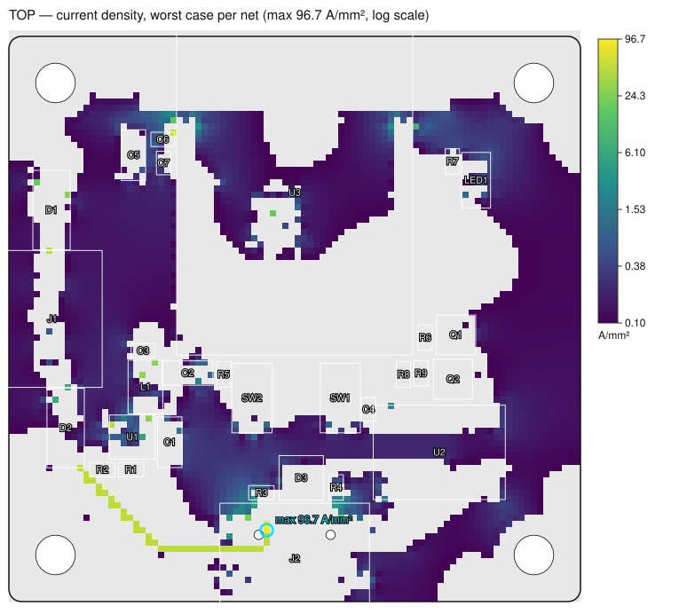
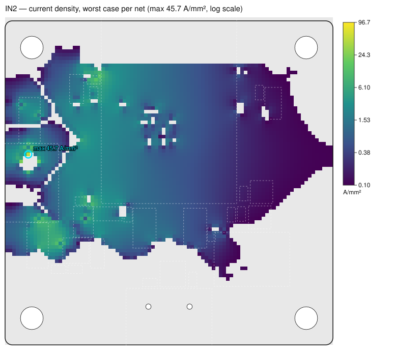

# 设计后仿真验证 Post-layout verification

在**完成布线的真实铜皮**（`pcb dump --include-copper` 回读，或 pcb auto 结果同构导出）上，用 `sim power` 的每引脚电流与器件功耗，求解直流压降与稳态温升。边界：**板级**——裸板静止空气，上下表面自然对流，不含外壳、风扇或气流（非 CFD）。

| 项 | 值 |
|---|---|
| 结论 | **PASS** |
| 板 | `artifacts/v05-live/final.reload.json` |
| semanticSha256 | `208a2bcb43bebf4cbcbd34f8d3197875e8f7687ce1d5dc4e1b65900ebea40703` |
| 仿真 | `artifacts/v05-live/sim.json` |
| 场景 | typical, peak, buttons-pressed, terminal-only, usb-only（scenarios） |
| 网格 | 0.5 mm × 92×92 单元，每单元 5×5 子采样，板内 8218 单元/层 |
| 环境 | 25 °C，h 顶 10.0 / 底 10.0 W/m²K |
| 预算 | IR 2%,30mV；铜温升 10 °C；余量 ×1.2 |

## 1. 真实铜皮直流压降 IR drop on the real copper

| 网络 | 角色 | 最坏场景 | 参考 | 电流 A | 预算 mV | 最坏压降 mV | 最坏焊盘 | 铜损 mW | 最大 J A/mm² | 最大过孔 A | 铜自热 °C | 状态 |
|---|---|---|---|---|---|---|---|---|---|---|---|---|
| +3V3 | power | peak | L1 | 0.521 | 66.4 | 2.70 | U3.2 | 1.374 | 56.4 | 0.501 | 0.32 | ✓ 通过 |
| +5V_TERM | power | terminal-only | J1 | 0.427 | 99.8 | 0.99 | D1.2 | 0.423 | 48.0 | 0.427 | 0.25 | ✓ 通过 |
| USB_VBUS | power | usb-only | J2 | 0.430 | 99.1 | 17.07 | D2.2 | 7.336 | 96.7 | 0.000 | 0.40 | ✓ 通过 |
| VSYS_5V | power | terminal-only | D1 | 0.427 | 92.5 | 13.61 | U1.4 | 5.804 | 48.0 | 0.430 | 0.31 | ✓ 通过 |
| LX | switch | peak | U1 | 0.521 | — | 0.27 | L1.1 | 0.138 | 29.3 | 0.000 | 0.29 | 仅报告 |
| GND | ground | usb-only | J2 | 0.430 | — | 0.34 | U3.41 | 0.147 | 23.4 | 0.167 | 0.35 | 仅报告 |

**+3V3**（power，74 段走线，5330 个面铜单元，14 个过孔）：各场景最坏 typical 0.56 mV · peak 2.70 mV · buttons-pressed 0.56 mV · terminal-only 2.70 mV · usb-only 2.70 mV

| 焊盘 | 方向 | 电流 A | 压降 mV | 电压 V | 场景 |
|---|---|---|---|---|---|
| R1.1 | sink | 0.0001 | 0.377 | 3.3176 | peak |
| R5.2 | sink | 0.0003 | 0.152 | 3.3178 | buttons-pressed |
| R6.2 | sink | 0.0003 | 0.203 | 3.3178 | buttons-pressed |
| U2.16 | sink | 0.0200 | 0.930 | 3.3171 | peak |
| U3.2 | sink | 0.5014 | 2.704 | 3.3153 | peak |

电流密度热点：TOP track (524,1483) 56.4 A/mm² @ 10.0 mil；TOP track (433,717) 31.2 A/mm² @ 10.0 mil；IN2 sheet (502,1466) 13.9 A/mm²；IN2 sheet (482,778) 9.4 A/mm²；IN2 sheet (463,699) 6.8 A/mm²

**+5V_TERM**（power，22 段走线，271 个面铜单元，1 个过孔）：各场景最坏 typical 0.11 mV · peak 0.57 mV · buttons-pressed 0.11 mV · terminal-only 0.99 mV

| 焊盘 | 方向 | 电流 A | 压降 mV | 电压 V | 场景 |
|---|---|---|---|---|---|
| D1.2 | sink | 0.4265 | 0.993 | 4.9905 | terminal-only |

电流密度热点：TOP track (136,1114) 48.0 A/mm² @ 10.0 mil；IN2 track (133,1055) 45.7 A/mm² @ 10.0 mil；IN2 track (85,1007) 22.8 A/mm² @ 10.0 mil；IN2 track (182,1007) 17.7 A/mm² @ 10.0 mil；IN2 track (133,958) 9.8 A/mm² @ 10.0 mil

**USB_VBUS**（power，70 段走线，890 个面铜单元，4 个过孔）：各场景最坏 typical 1.70 mV · peak 7.17 mV · buttons-pressed 1.71 mV · terminal-only 0.00 mV · usb-only 17.07 mV

| 焊盘 | 方向 | 电流 A | 压降 mV | 电压 V | 场景 |
|---|---|---|---|---|---|
| D2.2 | sink | 0.4298 | 17.071 | 4.9399 | usb-only |
| D3.5 | sink | 0.0000 | 0.000 | 4.9819 | peak |

电流密度热点：TOP track (822,223) 96.7 A/mm² @ 5.0 mil；TOP track (239,406) 48.3 A/mm² @ 10.0 mil；TOP track (425,221) 48.3 A/mm² @ 10.0 mil；TOP track (513,161) 48.3 A/mm² @ 10.0 mil；TOP track (628,161) 48.3 A/mm² @ 10.0 mil

**VSYS_5V**（power，66 段走线，562 个面铜单元，7 个过孔）：各场景最坏 typical 1.59 mV · peak 8.27 mV · buttons-pressed 1.60 mV · terminal-only 13.61 mV · usb-only 1.53 mV

| 焊盘 | 方向 | 电流 A | 压降 mV | 电压 V | 场景 |
|---|---|---|---|---|---|
| D2.1 | sink | 0.0000 | 12.424 | 4.6151 | terminal-only |
| U1.4 | sink | 0.4265 | 13.608 | 4.6139 | terminal-only |

电流密度热点：BOTTOM track (190,752) 48.0 A/mm² @ 10.0 mil；BOTTOM track (190,867) 48.0 A/mm² @ 10.0 mil；BOTTOM track (190,964) 48.0 A/mm² @ 10.0 mil；BOTTOM track (190,1156) 48.0 A/mm² @ 10.0 mil；BOTTOM track (190,1079) 48.0 A/mm² @ 10.0 mil

**LX**（switch，8 段走线，0 个面铜单元，0 个过孔）：各场景最坏 typical 0.06 mV · peak 0.27 mV · buttons-pressed 0.06 mV · terminal-only 0.27 mV · usb-only 0.27 mV

| 焊盘 | 方向 | 电流 A | 压降 mV | 电压 V | 场景 |
|---|---|---|---|---|---|
| L1.1 | sink | 0.5215 | 0.265 | 3.4058 | peak |

电流密度热点：TOP track (436,590) 29.3 A/mm² @ 20.0 mil

**GND**（ground，419 段走线，20999 个面铜单元，33 个过孔）：各场景最坏 typical 0.05 mV · peak 0.26 mV · buttons-pressed 0.05 mV · terminal-only 0.31 mV · usb-only 0.34 mV

| 焊盘 | 方向 | 电流 A | 压降 mV | 电压 V | 场景 |
|---|---|---|---|---|---|
| D3.2 | source | 0.0000 | 0.125 | 0.0001 | terminal-only |
| J2.A1B12 | sink | 0.0903 | 0.010 | 0.0000 | peak |
| J2.B1A12 | sink | 0.0903 | 0.009 | 0.0000 | peak |
| LED1.2 | source | 0.0014 | 0.208 | 0.0002 | usb-only |
| R2.2 | source | 0.0001 | 0.123 | 0.0001 | usb-only |
| SW1.2 | source | 0.0003 | 0.014 | 0.0000 | buttons-pressed |
| SW2.2 | source | 0.0003 | 0.011 | 0.0000 | buttons-pressed |
| U1.2 | sink | 0.0917 | 0.081 | 0.0001 | usb-only |
| U2.1 | source | 0.0200 | 0.154 | 0.0001 | terminal-only |
| U3.1 | source | 0.1667 | 0.292 | 0.0003 | usb-only |
| U3.40 | source | 0.1667 | 0.282 | 0.0003 | usb-only |
| U3.41 | source | 0.1667 | 0.335 | 0.0003 | usb-only |

电流密度热点：TOP track (766,269) 23.4 A/mm² @ 10.0 mil；TOP track (829,1226) 18.7 A/mm² @ 10.0 mil；TOP track (1044,268) 17.4 A/mm² @ 10.0 mil；TOP track (531,1529) 14.7 A/mm² @ 10.0 mil；TOP track (1280,1510) 7.7 A/mm² @ 10.0 mil

## 2. 过孔电流 Via currents

载流量 = IPC-2221 外层曲线作用于孔壁截面 π(d+t)t，ΔT 10 °C。

| 过孔 | 网络 | x, y (mil) | 钻孔 mil | 电流 A | 载流量 A | 占用 % | 场景 |
|---|---|---|---|---|---|---|---|
| cdcdc548d58f5566 | +3V3 | 507, 1494 | 12.0 | 0.501 | 1.48 | 33.9 | peak |
| 891be1e0eba1a205 | VSYS_5V | 305, 561 | 12.0 | 0.430 | 1.48 | 29.1 | usb-only |
| 03ed44667039bdb4 | VSYS_5V | 190, 692 | 12.0 | 0.427 | 1.48 | 28.9 | terminal-only |
| 150dad8633756bdf | VSYS_5V | 190, 1274 | 12.0 | 0.427 | 1.48 | 28.9 | terminal-only |
| 1ac9cdd8d17c7573 | +5V_TERM | 136, 1101 | 12.0 | 0.427 | 1.48 | 28.9 | terminal-only |
| 707d96adacb27378 | +3V3 | 436, 705 | 12.0 | 0.277 | 1.48 | 18.8 | peak |
| 7ba87c0ebe67d13d | +3V3 | 471, 778 | 12.0 | 0.244 | 1.48 | 16.5 | peak |
| 0080845cbc03db52 | VSYS_5V | 126, 638 | 12.0 | 0.229 | 1.48 | 15.5 | usb-only |
| a7a252fee99dfffb | VSYS_5V | 82, 1328 | 12.0 | 0.170 | 1.48 | 11.5 | terminal-only |
| 2bbb88abb75a4b4d | GND | 820, 1235 | 12.0 | 0.167 | 1.48 | 11.3 | peak |
| 91373236bb3f3383 | GND | 1056, 267 | 12.0 | 0.146 | 1.48 | 9.9 | usb-only |
| 0d47fce6d92fb72f | GND | 753, 270 | 12.0 | 0.103 | 1.48 | 7.0 | usb-only |

## 3. 稳态热仿真 Thermal

最热场景 **terminal-only**：板最高 **86.3 °C**（TOP，(561, 1152) mil，U3 下方）。热源 2.137 W（器件 2.129 W + 铜损 0.0079 W），对流散出 2.137 W，能量平衡误差 -0.0000 %。铜损单独作用（usb-only）时铜自身最大温升 0.40 °C。

| 场景 | 器件 W | 铜损 W | 最高 °C | 散出 W | 平衡误差 % |
|---|---|---|---|---|---|
| typical | 0.444 | 0.0002 | 37.6 | 0.445 | -0.0000 |
| peak | 2.115 | 0.0053 | 85.6 | 2.120 | -0.0000 |
| buttons-pressed | 0.447 | 0.0002 | 37.6 | 0.447 | -0.0000 |
| terminal-only | 2.129 | 0.0079 | 86.3 | 2.137 | -0.0000 |
| usb-only | 2.130 | 0.0097 | 85.8 | 2.140 | -0.0000 |

| 层 | 最高 °C | 平均 °C | 位置 (mil) |
|---|---|---|---|
| TOP | 86.3 | 77.8 | 561, 1152 |
| IN1 | 83.5 | 77.6 | 581, 1112 |
| IN2 | 80.7 | 76.4 | 758, 1230 |
| BOTTOM | 80.4 | 76.2 | 758, 1230 |

| 器件 | 面 | 功耗 W | 场景 | 板温 max / 均 °C | θ °C/W | Tj °C | Tj,max | 状态 |
|---|---|---|---|---|---|---|---|---|
| U3 | TOP | 1.6591 | terminal-only | 86.3 / 84.3 | — | — | — | 需数据手册（no θJB/θJC in power-models ratings: board temperature only） |
| U1 | TOP | 0.1976 | usb-only | 83.3 / 82.5 | — | — | — | 需数据手册（no θJB/θJC in power-models ratings: board temperature only） |
| SW2 | TOP | 0.0000 | usb-only | 82.8 / 80.2 | — | — | — | ✓ 通过 |
| C7 | TOP | 0.0000 | terminal-only | 82.5 / 82.2 | — | — | — | ✓ 通过 |
| D1 | TOP | 0.1552 | terminal-only | 82.4 / 82.0 | — | — | — | 需数据手册（no θJB/θJC in power-models ratings: board temperature only） |
| SW1 | TOP | 0.0000 | usb-only | 82.3 / 79.2 | — | — | — | ✓ 通过 |
| L1 | TOP | 0.0460 | usb-only | 82.2 / 81.6 | — | — | — | 需数据手册（no θJB/θJC in power-models ratings: board temperature only） |
| C2 | TOP | 0.0000 | usb-only | 82.1 / 81.1 | — | — | — | ✓ 通过 |
| D2 | TOP | 0.1565 | usb-only | 81.8 / 81.2 | — | — | — | 需数据手册（no θJB/θJC in power-models ratings: board temperature only） |
| C1 | TOP | 0.0000 | usb-only | 81.7 / 79.7 | — | — | — | ✓ 通过 |
| C5 | TOP | 0.0000 | terminal-only | 81.5 / 80.7 | — | — | — | ✓ 通过 |
| C6 | TOP | 0.0000 | terminal-only | 81.5 / 81.2 | — | — | — | ✓ 通过 |
| C3 | TOP | 0.0000 | usb-only | 81.2 / 81.0 | — | — | — | ✓ 通过 |
| R5 | TOP | 0.0000 | usb-only | 80.7 / 80.4 | — | — | — | ✓ 通过 |
| J1 | TOP | 0.0000 | terminal-only | 80.3 / 79.2 | — | — | — | ✓ 通过 |
| R6 | TOP | 0.0000 | usb-only | 80.0 / 79.3 | — | — | — | ✓ 通过 |
| R2 | TOP | 0.0000 | usb-only | 79.8 / 79.5 | — | — | — | 需数据手册（no θJB/θJC in power-models ratings: board temperature only） |
| R1 | TOP | 0.0002 | usb-only | 79.6 / 79.1 | — | — | — | 需数据手册（no θJB/θJC in power-models ratings: board temperature only） |
| R8 | TOP | 0.0000 | usb-only | 78.5 / 78.2 | — | — | — | ✓ 通过 |
| R7 | TOP | 0.0020 | terminal-only | 78.5 / 78.1 | — | — | — | 需数据手册（no θJB/θJC in power-models ratings: board temperature only） |
| R9 | TOP | 0.0000 | usb-only | 78.5 / 77.5 | — | — | — | ✓ 通过 |
| Q1 | TOP | 0.0000 | usb-only | 78.3 / 77.0 | — | — | — | ✓ 通过 |
| C4 | TOP | 0.0000 | usb-only | 78.1 / 77.5 | — | — | — | ✓ 通过 |
| LED1 | TOP | 0.0026 | terminal-only | 77.7 / 77.1 | — | — | — | 需数据手册（no θJB/θJC in power-models ratings: board temperature only） |
| U2 | TOP | 0.0664 | usb-only | 77.3 / 74.8 | — | — | — | 需数据手册（no θJB/θJC in power-models ratings: board temperature only） |
| D3 | TOP | 0.0000 | usb-only | 76.7 / 75.8 | — | — | — | 需数据手册（no θJB/θJC in power-models ratings: board temperature only） |
| Q2 | TOP | 0.0000 | usb-only | 76.5 / 75.8 | — | — | — | ✓ 通过 |
| R3 | TOP | 0.0000 | usb-only | 76.3 / 76.2 | — | — | — | ✓ 通过 |
| J2 | TOP | 0.0000 | usb-only | 76.1 / 74.8 | — | — | — | ✓ 通过 |
| R4 | TOP | 0.0000 | usb-only | 75.2 / 75.0 | — | — | — | ✓ 通过 |

## 4. 热图与电流密度图 Maps

**TOP 温度**（68.88–86.28 °C）

**IN1 温度**（68.88–86.28 °C）

**IN2 温度**（68.88–86.28 °C）

**BOTTOM 温度**（68.88–86.28 °C）

**TOP 电流密度**（0.10–96.68 A/mm²）

**IN1 电流密度**（0.10–96.68 A/mm²）

**IN2 电流密度**（0.10–96.68 A/mm²）

**BOTTOM 电流密度**（0.10–96.68 A/mm²）

## 5. 铜皮修改建议 Copper feedback

没有需要加宽的走线、需要倒角的拐角或过孔瓶颈（判据：IPC-2152 载流 × 余量 1.2、铜自热 ≤ 10 °C、拐角拥挤系数 1 + (180° − 角度)/180°、过孔占用 ≤ 50 %）。

## 6. 与 pcb auto 布线期 IR 估算对比

| 网络 | pcb auto mV | 焊盘 | 设计后 mV | 焊盘 | 差 mV | 设计后场景 |
|---|---|---|---|---|---|---|
| +3V3 | 3.83 | U3.2 | 2.70 | U3.2 | -1.12 | peak |
| +5V_TERM | 1.98 | D1.2 | 0.99 | D1.2 | -0.99 | terminal-only |
| GND | 1.12 | U3.1 | 0.34 | U3.41 | -0.78 | usb-only |
| LX | 0.61 | L1.1 | 0.27 | L1.1 | -0.35 | peak |
| USB_VBUS | 17.87 | D2.2 | 17.07 | D2.2 | -0.80 | usb-only |
| VSYS_5V | 15.62 | U1.4 | 13.61 | U1.4 | -2.01 | terminal-only |

差异来源（两者都是 DC 电阻网络，但输入与离散化不同）：

- pcb auto 从焊盘**中心**量走线长度；这里走线在焊盘内的部分被焊盘铜短接（焊盘比走线宽得多），每个焊盘端少约半个焊盘长的走线电阻。
- pcb auto 的平面/铺铜是它自己规划的多边形上 ≥ 25 mil 的粗网格，且不扣反焊盘（乐观）；这里用宿主**真实灌铜**（含净距挖空、热焊盘辐条），0.5 mm 单元。
- pcb auto 过孔长度取板厚/(层数−1) 等分；这里按叠层真实 z（外层半固化片 0.21 mm、芯板 1.07 mm）。
- pcb auto 对合并的 worst 文件逐个供电源求包络；这里逐场景（各自满足 KCL）求解再取最坏。

## 7. Elmer FEM 交叉校验

状态：**skipped**。ElmerSolver not installed — run: pcbpilot sim tools install --only elmer. The deck is written for a later run (cd examples/esp32-mini-post-layout/elmer && ElmerSolver case.sif), then `pcbpilot sim post-layout … --elmer-result examples/esp32-mini-post-layout/elmer/probes.dat`

输入包：`examples/esp32-mini-post-layout/elmer`（32872 节点、23910 六面体、15940 边界面、244 体）。

| 探针 | 本模型 °C | Elmer °C | 差 °C |
|---|---|---|---|
| board max | 86.28 | — | — |
| D1 | 82.44 | — | — |
| D2 | 78.59 | — | — |
| L1 | 80.98 | — | — |
| U1 | 81.98 | — | — |
| U2 | 77.02 | — | — |
| U3 | 86.28 | — | — |

## 模型与假设 Model and assumptions

- copper from the board dump: tracks/arcs = 1-D resistors ρL/(w·t) split at junctions/vias/pads and at every cell; poured fills, static fills, planes = sheet cells G = (t/ρ)·min(harmonic coverage, shared-edge copper fraction); pads shorted to the sheet they overlap
- ρ = 1.72e-08 Ω·m (20 °C); via barrel R = ρ·h/(π(d+t)t), plating t = 0.7 mil, h = layer-centre distance
- stackup: TOP 35.0 µm @ z 0.018 mm; IN1 17.5 µm @ z 0.254 mm; IN2 17.5 µm @ z 1.346 mm; BOTTOM 35.0 µm @ z 1.583 mm; dielectrics [0.2104 1.0742 0.2104] mm (JLC04161H-7628 (4-layer 1.6 mm, L1→L2 prepreg 0.2104 mm))
- each scenario of the sim file is solved on its own (KCL-consistent): the supplying part (power: source pins; ground: return entry, connector-source first) is the 0 V reference, every other pad draws (+I) or feeds (−I) its simulated current; worst = maximum over scenarios
- via ampacity = IPC-2221 external curve on the barrel cross-section π(d+t)t at ΔT 10 °C (IPC-2152: internal ≈ external)
- thermal: per layer k_Cu 385 W/mK × t × coverage + FR-4 0.3 W/mK in-plane over half of each adjacent dielectric; FR-4 0.3 W/mK through-plane + via barrels; convection top/bottom; part heat on its pads by area; Joule heat from the DC solve; board edges adiabatic; part bodies do not convect separately (their top face shares the board's h)
- Tj = board temperature under the part + P·θJB (θJC when only that is rated); without a rating only the board temperature is reported
- 2 through-hole pad(s) carry no drill in the dump: plated hole assumed = 0.5 × the smaller pad side
- 83 thermal-relief spoke(s) of the poured copper modelled as tracks of their stroke width
- IN1 has no copper objects in the dump (a negative/内电层 plane is not listed by pcb dump): assumed a solid GND plane — board outline inset 10 mil (copper-to-edge), antipads around every other-net via / THT pad / cutout = its copper + 6.0 mil clearance, same-net vias connect directly (thermal-relief spokes ignored). Override with --plane 15=NET or --plane 15=none
- boundary: the bare board in still air — natural convection on both faces (top 10.0, bottom 10.0 W/m²K), no enclosure, fan or airflow (no CFD); board edges adiabatic

## 发现 Findings

- [info] needs-datasheet: U3 (1.66 W, board 86.3 °C): no θJB/θJC rating — junction not estimated
- [info] needs-datasheet: U1 (0.198 W, board 83.3 °C): no θJB/θJC rating — junction not estimated
- [info] needs-datasheet: D1 (0.155 W, board 82.4 °C): no θJB/θJC rating — junction not estimated
- [info] needs-datasheet: L1 (0.046 W, board 82.2 °C): no θJB/θJC rating — junction not estimated
- [info] needs-datasheet: D2 (0.157 W, board 81.8 °C): no θJB/θJC rating — junction not estimated
- [info] needs-datasheet: R2 (3.6e-05 W, board 79.8 °C): no θJB/θJC rating — junction not estimated
- [info] needs-datasheet: R1 (0.000163 W, board 79.6 °C): no θJB/θJC rating — junction not estimated
- [info] needs-datasheet: R7 (0.00196 W, board 78.5 °C): no θJB/θJC rating — junction not estimated
- [info] needs-datasheet: LED1 (0.00261 W, board 77.7 °C): no θJB/θJC rating — junction not estimated
- [info] needs-datasheet: U2 (0.0664 W, board 77.3 °C): no θJB/θJC rating — junction not estimated
- [info] needs-datasheet: D3 (1e-06 W, board 76.7 °C): no θJB/θJC rating — junction not estimated
